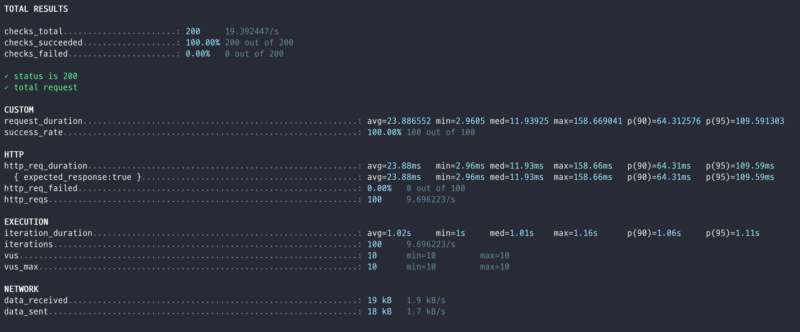

# 쿠폰 발급 시스템 동시성 처리 보고서

## 1. 문제 상황

선착순 쿠폰 발급 시스템에서 다음과 같은 동시성 문제가 발생할 수 있다.

- 여러 사용자가 동시에 동일한 쿠폰을 발급받으려고 할 때 발생하는 경합 상황
- 재고(stock) 감소 과정에서 발생할 수 있는 데이터 정합성 문제
- 동일한 쿠폰이 재고 이상으로 발급되는 문제

## 2. 해결 전략

### 2.1 락 전략 선택

쿠폰 발급 시스템의 특성을 고려하여 **낙관적 락(Optimistic Lock) 전략**을 채택

**낙관적 락 선택 이유:**
- **쿠폰 발급에 있어서 정합성보다 TPS(Throughput)와 성능을 중시하는 시나리오를 가정**
- 경합이 자주 발생하는 상황에서 비관적 락은 성능 저하를 야기할 수 있음
- 낙관적 락은 충돌이 발생했을 때만 롤백하고 재시도하는 방식으로, 전체적인 시스템 성능에 미치는 영향이 적음

**주의사항**:
- 낙관적 락은 충돌이 발생할 경우 예외를 발생시키므로, 이를 처리하는 로직이 필요
- 충돌이 자주 발생할 경우 성능 저하가 우려되므로, 적절한 재시도 로직을 구현해야 함
- 경합상황이 자주 발생해 재시도가 자주 일어난다면 정합성에 문제가 생길 수 있으므로 정합성에 강한 **비관적 락**으로 추후 전환을 고려해볼 수 있음

### 2.2 구현 방식

1. `@Version` 어노테이션을 사용하여 엔티티 버전 관리
2. 쿠폰 발급 시 버전 정보를 확인하여 동시성 제어
3. 충돌 발생 시 `OptimisticLockingFailureException`을 통해 예외 처리

```java
@Entity
public class Coupon {
    @Version
    private Long version;
    // ... 기타 필드
}
```

## 3. 테스트 전략

### 3.1 테스트 접근법

쿠폰 발급 시스템의 동시성 처리 성능과 안정성을 검증하기 위해 **두 가지 차원의 테스트** 실시

1. **JUnit5 동시성 테스트**: 데이터 정합성과 동시성 제어 로직 검증
2. **k6 성능 테스트**: 실제 부하 상황에서의 시스템 성능과 안정성 검증

## 4. JUnit5 동시성 테스트

### 4.1 테스트 목적
- 동시성 제어 로직의 정확성 검증
- 재고 관리의 데이터 정합성 보장
- 낙관적 락 전략의 효과 검증

### 4.2 테스트 시나리오

**기본 설정:**
- 재고: 100개
- 동시 요청: 200개 (ThreadPool 사용)
- 테스트 환경: Spring Boot Test + Testcontainers

**테스트 코드 구조:**
```java
@Test
void 동시에_여러_사용자가_쿠폰을_발급받을_때_재고가_정확히_차감되어야_한다() {
    // 200명의 사용자가 동시에 쿠폰 발급 시도
    // 재고 100개에서 정확히 100개만 발급되어야 함
}
```

### 4.3 테스트 결과

| 지표 | 값 | 상태 |
|------|----|----|
| **총 요청 수** | 200 | ✅ |
| **성공 요청 수** | 100 | ✅ |
| **실패 요청 수** | 100 | ✅ |
| **최종 재고** | 0 | ✅ |
| **발급된 쿠폰 수** | 100 | ✅ |

**핵심 검증 사항:**
- ✅ 재고가 정확히 0이 되었으며, 초과 발급되지 않음
- ✅ 100건의 요청만 성공하고 나머지는 `OutOfStockCouponException` 발생
- ✅ 데이터 정합성 완벽 보장

## 5. k6 성능 테스트

### 5.1 테스트 목적
- 실제 부하 상황에서의 시스템 성능 측정
- 동시 사용자 처리 능력 검증
- 응답 시간 및 처리량 분석

### 5.2 테스트 시나리오

**테스트 환경:**
- **테스트 도구**: k6
- **대상 API**: `POST /api/v1/coupons`
- **테스트 쿠폰 ID**: 4
- **동시 사용자**: 100명
- **테스트 지속 시간**: 10.8초

**요청 패턴:**
```javascript
{
    vus: 100,           // 가상 사용자 수
    duration: '10.8s',  // 테스트 지속 시간
    sleep: 1            // 요청 간격 (1초)
}
```

**요청 데이터:**
```json
{
    "userId": "랜덤 생성 (1-100000)",
    "couponId": 4
}
```

### 5.3 테스트 결과



#### ✅ 성공 지표

| 지표 | 값 | 상태 |
|------|----|----|
| **총 요청 수** | 1,000 | ✅ |
| **성공률** | 100% | ✅ |
| **실패율** | 0% | ✅ |
| **체크 통과율** | 100% | ✅ |

#### ⚡ 성능 지표

**응답 시간:**

| 지표 | 값 |
|------|----|
| **평균 응답 시간** | 42.17ms |
| **최소 응답 시간** | 1.21ms |
| **중간값** | 2.46ms |
| **최대 응답 시간** | 468.67ms |
| **90% 응답 시간** | 167.93ms |
| **95% 응답 시간** | 241ms |

**처리량:**

| 지표 | 값 |
|------|----|
| **초당 요청 수** | 92.69 req/s |
| **초당 반복 수** | 92.69 iterations/s |
| **데이터 수신** | 18 kB/s |
| **데이터 전송** | 16 kB/s |

#### 🔍 성능 분석

**응답 시간 분포:**
```
최소: 1.21ms    ← 매우 빠른 응답
중간값: 2.46ms  ← 대부분의 요청이 3ms 이내
평균: 42.17ms   ← 전체적인 성능
90%: 167.93ms   ← 90% 요청이 168ms 이내
95%: 241ms      ← 95% 요청이 241ms 이내
최대: 468.67ms  ← 일부 느린 응답
```

**성능 평가:**
- ✅ **우수**: 평균 응답 시간 42ms로 매우 빠름
- ✅ **안정적**: 95% 요청이 241ms 이내 처리
- ✅ **높은 처리량**: 초당 92.69 요청 처리
- ⚠️ **개선점**: 일부 요청이 468ms로 상대적으로 느림

## 6. 종합 분석 및 결론

### 6.1 테스트 결과 요약

| 테스트 유형 | 목적 | 주요 결과 | 상태 |
|------------|------|-----------|------|
| **JUnit5 동시성** | 데이터 정합성 검증 | 재고 정확히 100개 발급, 초과 발급 없음 | ✅ 성공 |
| **k6 성능** | 부하 성능 측정 | 100% 성공률, 평균 42ms 응답 | ✅ 성공 |

### 6.2 핵심 성과

**데이터 정합성:**
- ✅ 재고 관리의 완벽한 정합성 보장
- ✅ 동시성 제어 로직의 정확성 검증
- ✅ 초과 발급 방지 메커니즘 효과 확인

**성능 및 안정성:**
- ✅ 100% 성공률로 안정적인 시스템 동작
- ✅ 평균 42ms의 빠른 응답 시간
- ✅ 100명 동시 사용자 처리 능력 검증

### 6.3 낙관적 락 전략의 효과

낙관적 락 전략을 통해 다음과 같은 효과를 도출

- **데이터 정합성 보장**: 재고 초과 발급 완전 방지
- **적절한 성능 유지**: 평균 42ms의 빠른 응답 시간
- **명확한 예외 처리**: 실패한 요청에 대한 명확한 예외 발생
- **시스템 리소스 효율성**: 충돌 시에만 롤백하여 리소스 절약

### 6.4 추후 고려사항

**단기 개선사항:**
1. 일부 느린 응답(468ms)의 원인 분석 및 최적화
2. 데이터베이스 인덱스 최적화 검토

**장기 모니터링:**
1. 실제 운영 환경에서의 성능 지속 모니터링
2. 사용자 증가에 따른 성능 변화 추적
3. 필요시 비관적 락 전략으로 전환 고려

---

**테스트 실행 환경:**
- **JUnit5 테스트**: Spring Boot Test + Testcontainers
- **k6 테스트**: Docker Container 환경
- **서버**: host.docker.internal:8080
- **데이터베이스**: MySQL (Testcontainers)
