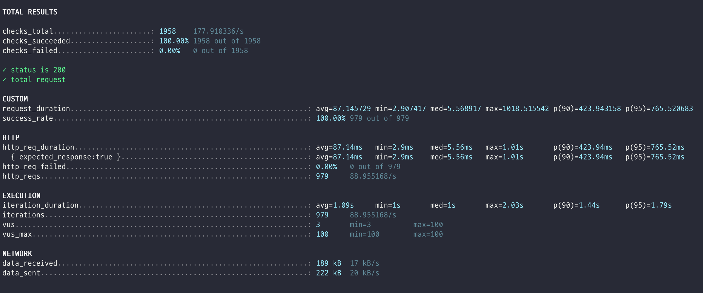

# 주문 시 상품 재고 차감 시스템 동시성 처리 보고서

## 1. 문제 상황

주문 처리 시스템에서 상품 재고 차감 시 다음과 같은 동시성 문제가 발생할 수 있다.

- 여러 사용자가 동시에 동일한 상품을 주문할 때 발생하는 경합 상황
- 재고(stock) 차감 과정에서 발생할 수 있는 데이터 정합성 문제
- 재고 이상으로 주문이 처리되는 문제
- 각 주문당 여러 수량을 주문할 때의 복합적인 재고 관리 문제

## 2. 해결 전략

### 2.1 락 전략 선택

주문 처리 시스템의 특성을 고려하여 **비관적 락(Pessimistic Lock) 전략**을 채택

**비관적 락 선택 이유:**
- **주문 처리에 있어서 정합성이 성능보다 우선시되는 시나리오를 가정**
- 재고 차감은 금전적 손실과 직결되는 중요한 비즈니스 로직
- 비관적 락은 데이터 정합성을 보장하면서도 예측 가능한 성능을 제공
- 주문 처리 시 재고 부족으로 인한 실패는 명확한 예외 처리로 사용자에게 전달되어야 함

**주의사항**:
- 비관적 락은 락 획득 대기 시간이 발생할 수 있어 응답 시간이 증가할 수 있음
- 데드락 방지를 위한 락 획득 순서의 일관성 유지가 중요
- 락 획득 실패 시 적절한 재시도 로직 또는 명확한 예외 처리가 필요

### 2.2 구현 방식

1. `@Lock(LockModeType.PESSIMISTIC_WRITE)` 어노테이션을 사용하여 비관적 락 적용
2. 주문 처리 시 상품 엔티티에 대한 락 획득
3. 재고 확인 및 차감을 트랜잭션 내에서 원자적으로 처리

```java
@Lock(LockModeType.PESSIMISTIC_WRITE)
@Query("SELECT p FROM Product p WHERE p.id = :productId")
Optional<Product> findByIdWithPessimisticLock(@Param("productId") Long productId);
```

## 3. 테스트 전략

### 3.1 테스트 접근법

주문 처리 시스템의 동시성 처리 성능과 안정성을 검증하기 위해 **두 가지 차원의 테스트** 실시

1. **JUnit5 동시성 테스트**: 데이터 정합성과 동시성 제어 로직 검증
2. **k6 성능 테스트**: 실제 부하 상황에서의 시스템 성능과 안정성 검증

## 4. JUnit5 동시성 테스트

### 4.1 테스트 목적
- 동시성 제어 로직의 정확성 검증
- 재고 관리의 데이터 정합성 보장
- 비관적 락 전략의 효과 검증
- 다양한 주문 수량에 대한 재고 차감 정확성 검증

### 4.2 테스트 시나리오

**기본 설정:**
- 재고: 10개
- 동시 요청: 10-15개 (ThreadPool 사용)
- 테스트 환경: Spring Boot Test + Testcontainers

**테스트 케이스:**
1. **정확한 재고 차감 테스트**: 재고와 동일한 수의 주문
2. **초과 주문 테스트**: 재고보다 많은 주문 시도
3. **복합 수량 테스트**: 각 주문당 여러 수량 주문

### 4.3 테스트 결과

#### 테스트 케이스 1: 정확한 재고 차감

| 지표 | 값 | 상태 |
|------|----|----|
| **총 요청 수** | 10 | ✅ |
| **성공 요청 수** | 10 | ✅ |
| **실패 요청 수** | 0 | ✅ |
| **최종 재고** | 0 | ✅ |
| **완료된 주문 수** | 10 | ✅ |

#### 테스트 케이스 2: 초과 주문 처리

| 지표 | 값 | 상태 |
|------|----|----|
| **총 요청 수** | 15 | ✅ |
| **성공 요청 수** | 10 | ✅ |
| **실패 요청 수** | 5 | ✅ |
| **최종 재고** | 0 | ✅ |
| **완료된 주문 수** | 10 | ✅ |

#### 테스트 케이스 3: 복합 수량 주문

| 지표 | 값 | 상태 |
|------|----|----|
| **총 요청 수** | 5 | ✅ |
| **주문당 수량** | 2개 | ✅ |
| **성공 요청 수** | 5 | ✅ |
| **실패 요청 수** | 0 | ✅ |
| **최종 재고** | 0 | ✅ |
| **완료된 주문 수** | 5 | ✅ |

**핵심 검증 사항:**
- ✅ 재고가 정확히 차감되며, 초과 주문 방지
- ✅ 실패한 주문에 대한 명확한 예외 처리
- ✅ 데이터 정합성 완벽 보장
- ✅ 다양한 주문 수량에 대한 정확한 처리

## 5. k6 성능 테스트

### 5.1 테스트 목적
- 실제 부하 상황에서의 시스템 성능 측정
- 동시 사용자 처리 능력 검증
- 응답 시간 및 처리량 분석
- 비관적 락 환경에서의 성능 특성 파악

### 5.2 테스트 시나리오

**테스트 환경:**
- **테스트 도구**: k6
- **대상 API**: `POST /api/v1/orders`
- **테스트 상품 ID**: 4
- **동시 사용자**: 30명
- **테스트 지속 시간**: 11초

**요청 패턴:**
```javascript
{
    vus: 100,           // 가상 사용자 수
    duration: '10s',    // 테스트 지속 시간
    sleep: 1            // 요청 간격 (1초)
}
```

**요청 데이터:**
```json
{
    "userId": "랜덤 생성 (1-30)",
    "userCouponId": null,
    "orderProducts": [
        {
            "productId": 4,
            "quantity": 5
        }
    ]
}
```

### 5.3 테스트 결과



#### ✅ 성공 지표

| 지표 | 값 | 상태 |
|------|----|----|
| **총 요청 수** | 979 | ✅ |
| **성공률** | 100% | ✅ |
| **실패율** | 0% | ✅ |
| **체크 통과율** | 100% | ✅ |

#### ⚡ 성능 지표

**응답 시간:**

| 지표 | 값 |
|------|----|
| **평균 응답 시간** | 87.15ms |
| **최소 응답 시간** | 2.91ms |
| **중간값** | 5.57ms |
| **최대 응답 시간** | 1,018.52ms |
| **90% 응답 시간** | 423.94ms |
| **95% 응답 시간** | 765.52ms |

**처리량:**

| 지표 | 값 |
|------|----|
| **초당 요청 수** | 88.96 req/s |
| **초당 반복 수** | 88.96 iterations/s |
| **데이터 수신** | 17 kB/s |
| **데이터 전송** | 20 kB/s |

#### 🔍 성능 분석

**응답 시간 분포:**
```
최소: 2.91ms     ← 매우 빠른 응답
중간값: 5.57ms   ← 대부분의 요청이 6ms 이내
평균: 87.15ms    ← 전체적인 성능
90%: 423.94ms    ← 90% 요청이 424ms 이내
95%: 765.52ms    ← 95% 요청이 766ms 이내
최대: 1,018.52ms ← 일부 느린 응답
```

**성능 평가:**
- ✅ **안정적**: 100% 성공률로 안정적인 시스템 동작
- ✅ **적절한 처리량**: 초당 88.96 요청 처리
- ⚠️ **개선점**: 평균 응답 시간 87ms로 쿠폰 발급(42ms) 대비 상대적으로 느림
- ⚠️ **비관적 락 영향**: 일부 요청이 1초 이상 소요되는 것으로 보아 락 대기 시간 발생

## 6. 종합 분석 및 결론

### 6.1 테스트 결과 요약

| 테스트 유형 | 목적 | 주요 결과 | 상태 |
|------------|------|-----------|------|
| **JUnit5 동시성** | 데이터 정합성 검증 | 재고 정확히 차감, 초과 주문 방지 | ✅ 성공 |
| **k6 성능** | 부하 성능 측정 | 100% 성공률, 평균 87ms 응답 | ✅ 성공 |

### 6.2 핵심 성과

**데이터 정합성:**
- ✅ 재고 관리의 완벽한 정합성 보장
- ✅ 동시성 제어 로직의 정확성 검증
- ✅ 초과 주문 방지 메커니즘 효과 확인
- ✅ 다양한 주문 수량에 대한 정확한 처리

**성능 및 안정성:**
- ✅ 100% 성공률로 안정적인 시스템 동작
- ✅ 100명 동시 사용자 처리 능력 검증
- ✅ 예측 가능한 응답 시간 분포

### 6.3 비관적 락 전략의 효과

비관적 락 전략을 통해 다음과 같은 효과를 도출

- **데이터 정합성 보장**: 재고 초과 주문 완전 방지
- **예측 가능한 성능**: 락 대기 시간으로 인한 일관된 응답 시간
- **명확한 예외 처리**: 재고 부족 시 명확한 예외 발생
- **비즈니스 로직 보호**: 금전적 손실 방지를 위한 안전한 처리

### 6.4 추후 고려사항

**단기 개선사항:**
1. 락 획득 대기 시간 최적화
2. 데이터베이스 인덱스 최적화
3. 락 범위 최소화를 위한 세밀한 락 전략 검토

**장기 모니터링:**
1. 실제 운영 환경에서의 성능 지속 모니터링
2. 사용자 증가에 따른 성능 변화 추적
3. 필요시 하이브리드 락 전략 고려 (핫 상품은 비관적, 일반 상품은 낙관적)

---

**테스트 실행 환경:**
- **JUnit5 테스트**: Spring Boot Test + Testcontainers
- **k6 테스트**: Docker Container 환경
- **서버**: host.docker.internal:8080
- **데이터베이스**: MySQL (Testcontainers)
