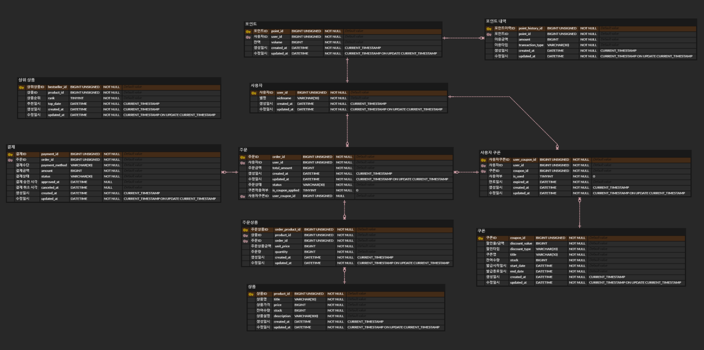

# ERD

- 상위 상품(Bestseller)는 초기에는 RDBMS 사용, 이후 Redis로 대체한다. (자주 조회되므로 캐싱 활용)
- 결제는 외부 플랫폼 이용을 가정한다.

## 상태 정의

### 💡 쿠폰 적용 여부 / 쿠폰 사용 여부
- 1: 쿠폰 적용 / 사용
- 0: 쿠폰 미적용 / 미사용

### 💡 상위 상품 순위
- `rank`: 상위 상품 순위 (1~5)

### 💡 포인트 이력 타입
- `CHARGE`: 잔액 충전
- `USE`: 잔액 사용

### 💡 주문 상태
- `DONE`: 주문 완료
- `CANCEL`: 주문 취소
- `WAITING`: 결제 대기

### 💡 결제 수단
- `POINT`: 포인트 결제
- `CARD`: 카드 결제
- `CASH`: 현금 결제

### 💡 결제 상태
- `SUCCESS`: 결제 성공
- `FAILED`: 결제 실패
- `PENDING`: 결제 대기
- `CANCELED`: 결제 취소
- `REFUNDED`: 결제 환불
