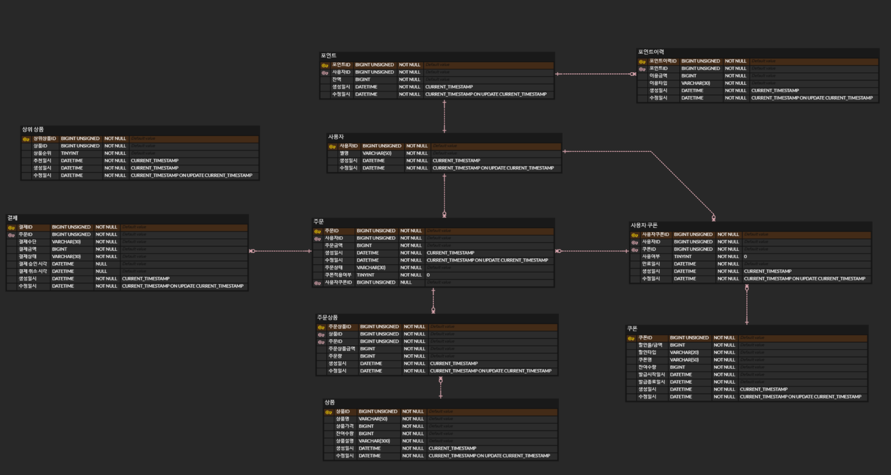

# ERD



- 상위 상품(Bestseller)는 초기에는 RDBMS 사용, 이후 Redis로 대체한다. (자주 조회되므로 캐싱 활용)
- 결제는 외부 플랫폼 이용을 가정한다.

## 상태 정의

### 💡 쿠폰 적용 여부 / 쿠폰 사용 여부
- 1: 쿠폰 적용 / 사용
- 0: 쿠폰 미적용 / 미사용

### 💡 쿠폰 할인 타입
- `AMOUNT`: 금액 할인
- `PERCENT`: 비율 할인


### 💡 상위 상품 순위
- `rank`: 상위 상품 순위 (1~5)


### 💡 포인트 이력 타입
- `CHARGE`: 잔액 충전
- `USE`: 잔액 사용


### 💡 주문 상태
- `DONE`: 주문 완료
- `CANCELED`: 주문 취소
- `WAITING`: 결제 대기


### 💡 결제 수단
- `POINT`: 포인트 결제
- `CARD`: 카드 결제
- `CASH`: 현금 결제

### 💡 결제 상태
- `APPROVED`: 결제 승인(성공)
- `FAILED`: 결제 실패
- `PENDING`: 결제 대기
- `CANCELED`: 결제 취소
- `REFUNDED`: 결제 환불

### 테이블 생성 쿼리
```sql
-- 사용자
CREATE TABLE `user` (
    `user_id` BIGINT UNSIGNED NOT NULL AUTO_INCREMENT,
    `nickname` VARCHAR(50) NOT NULL,
    `created_at` DATETIME NOT NULL DEFAULT CURRENT_TIMESTAMP,
    `updated_at` DATETIME NOT NULL DEFAULT CURRENT_TIMESTAMP ON UPDATE CURRENT_TIMESTAMP,
    PRIMARY KEY (`user_id`)
);

-- 쿠폰
CREATE TABLE `coupon` (
    `coupon_id` BIGINT UNSIGNED NOT NULL AUTO_INCREMENT,
    `discount_value` BIGINT NOT NULL,
    `discount_type` ENUM('AMOUNT', 'PERCENT') NOT NULL,
    `title` VARCHAR(50) NOT NULL,
    `stock` BIGINT NOT NULL,
    `start_date` DATETIME NOT NULL,
    `end_date` DATETIME NOT NULL,
    `created_at` DATETIME NOT NULL DEFAULT CURRENT_TIMESTAMP,
    `updated_at` DATETIME NOT NULL DEFAULT CURRENT_TIMESTAMP ON UPDATE CURRENT_TIMESTAMP,
    PRIMARY KEY (`coupon_id`)
);

-- 유저 쿠폰
CREATE TABLE `user_coupon` (
    `user_coupon_id` BIGINT UNSIGNED NOT NULL AUTO_INCREMENT,
    `user_id` BIGINT UNSIGNED NOT NULL,
    `coupon_id` BIGINT UNSIGNED NOT NULL,
    `is_used` TINYINT NOT NULL DEFAULT 0,
    `expired_at` DATETIME NOT NULL,
    `created_at` DATETIME NOT NULL DEFAULT CURRENT_TIMESTAMP,
    `updated_at` DATETIME NOT NULL DEFAULT CURRENT_TIMESTAMP ON UPDATE CURRENT_TIMESTAMP,
    PRIMARY KEY (`user_coupon_id`)
);

-- 주문
CREATE TABLE `orders` (
    `order_id` BIGINT UNSIGNED NOT NULL AUTO_INCREMENT,
    `user_id` BIGINT UNSIGNED NOT NULL,
    `total_amount` BIGINT NOT NULL,
    `created_at` DATETIME NOT NULL DEFAULT CURRENT_TIMESTAMP,
    `updated_at` DATETIME NOT NULL DEFAULT CURRENT_TIMESTAMP ON UPDATE CURRENT_TIMESTAMP,
    `status` VARCHAR(30) NOT NULL,
    `is_coupon_applied` TINYINT NOT NULL DEFAULT 0,
    `user_coupon_id` BIGINT UNSIGNED NULL,
    PRIMARY KEY (`order_id`)
);

-- 상품
CREATE TABLE `product` (
    `product_id` BIGINT UNSIGNED NOT NULL AUTO_INCREMENT,
    `name` VARCHAR(50) NOT NULL,
    `price` BIGINT NOT NULL,
    `stock` BIGINT NOT NULL,
    `description` VARCHAR(300) NOT NULL,
    `created_at` DATETIME NOT NULL DEFAULT CURRENT_TIMESTAMP,
    `updated_at` DATETIME NOT NULL DEFAULT CURRENT_TIMESTAMP ON UPDATE CURRENT_TIMESTAMP,
    PRIMARY KEY (`product_id`)
);

-- 주문 상품
CREATE TABLE `order_product` (
    `order_product_id` BIGINT UNSIGNED NOT NULL AUTO_INCREMENT,
    `product_id` BIGINT UNSIGNED NOT NULL,
    `order_id` BIGINT UNSIGNED NOT NULL,
    `unit_price` BIGINT NOT NULL,
    `quantity` BIGINT NOT NULL,
    `created_at` DATETIME NOT NULL DEFAULT CURRENT_TIMESTAMP,
    `updated_at` DATETIME NOT NULL DEFAULT CURRENT_TIMESTAMP ON UPDATE CURRENT_TIMESTAMP,
    PRIMARY KEY (`order_product_id`)
);

-- 결제
CREATE TABLE `payment` (
    `payment_id` BIGINT UNSIGNED NOT NULL AUTO_INCREMENT,
    `order_id` BIGINT UNSIGNED NOT NULL,
    `payment_method` VARCHAR(30) NOT NULL,
    `amount` BIGINT NOT NULL,
    `status` VARCHAR(30) NOT NULL,
    `approved_at` DATETIME NULL,
    `canceled_at` DATETIME NULL,
    `created_at` DATETIME NOT NULL DEFAULT CURRENT_TIMESTAMP,
    `updated_at` DATETIME NOT NULL DEFAULT CURRENT_TIMESTAMP ON UPDATE CURRENT_TIMESTAMP,
    PRIMARY KEY (`payment_id`)
);

-- 포인트
CREATE TABLE `point` (
    `point_id` BIGINT UNSIGNED NOT NULL AUTO_INCREMENT,
    `user_id` BIGINT UNSIGNED NOT NULL,
    `volume` BIGINT NOT NULL,
    `created_at` DATETIME NOT NULL DEFAULT CURRENT_TIMESTAMP,
    `updated_at` DATETIME NOT NULL DEFAULT CURRENT_TIMESTAMP ON UPDATE CURRENT_TIMESTAMP,
    PRIMARY KEY (`point_id`)
);

-- 포인트 내역
CREATE TABLE `point_history` (
    `point_history_id` BIGINT UNSIGNED NOT NULL AUTO_INCREMENT,
    `point_id` BIGINT UNSIGNED NOT NULL,
    `amount` BIGINT NOT NULL,
    `transaction_type` VARCHAR(30) NOT NULL,
    `created_at` DATETIME NOT NULL DEFAULT CURRENT_TIMESTAMP,
    `updated_at` DATETIME NOT NULL DEFAULT CURRENT_TIMESTAMP ON UPDATE CURRENT_TIMESTAMP,
    PRIMARY KEY (`point_history_id`)
);

-- 베스트셀러
CREATE TABLE `bestseller` (
    `bestseller_id` BIGINT UNSIGNED NOT NULL AUTO_INCREMENT,
    `product_id` BIGINT UNSIGNED NOT NULL,
    `rank` TINYINT NOT NULL,
    `top_date` DATETIME NOT NULL DEFAULT CURRENT_TIMESTAMP,
    `created_at` DATETIME NOT NULL DEFAULT CURRENT_TIMESTAMP,
    `updated_at` DATETIME NOT NULL DEFAULT CURRENT_TIMESTAMP ON UPDATE CURRENT_TIMESTAMP,
    PRIMARY KEY (`bestseller_id`)
);

-- 외래 키 제약 조건 추가
-- orders
ALTER TABLE `orders`
ADD CONSTRAINT `FK_orders_user` FOREIGN KEY (`user_id`) REFERENCES `user`(`user_id`);

ALTER TABLE `orders`
ADD CONSTRAINT `FK_orders_user_coupon` FOREIGN KEY (`user_coupon_id`) REFERENCES `user_coupon`(`user_coupon_id`);

-- order_product
ALTER TABLE `order_product`
ADD CONSTRAINT `FK_order_product_order` FOREIGN KEY (`order_id`) REFERENCES `orders`(`order_id`);

ALTER TABLE `order_product`
ADD CONSTRAINT `FK_order_product_product` FOREIGN KEY (`product_id`) REFERENCES `product`(`product_id`);

-- payment
ALTER TABLE `payment`
ADD CONSTRAINT `FK_payment_order` FOREIGN KEY (`order_id`) REFERENCES `orders`(`order_id`);

-- point
ALTER TABLE `point`
ADD CONSTRAINT `FK_point_user` FOREIGN KEY (`user_id`) REFERENCES `user`(`user_id`);

-- point_history
ALTER TABLE `point_history`
ADD CONSTRAINT `FK_point_history_point` FOREIGN KEY (`point_id`) REFERENCES `point`(`point_id`);

-- user_coupon
ALTER TABLE `user_coupon`
ADD CONSTRAINT `FK_user_coupon_user` FOREIGN KEY (`user_id`) REFERENCES `user`(`user_id`);

ALTER TABLE `user_coupon`
ADD CONSTRAINT `FK_user_coupon_coupon` FOREIGN KEY (`coupon_id`) REFERENCES `coupon`(`coupon_id`);

-- bestseller
ALTER TABLE `bestseller`
ADD CONSTRAINT `FK_bestseller_product` FOREIGN KEY (`product_id`) REFERENCES `product`(`product_id`);

```
