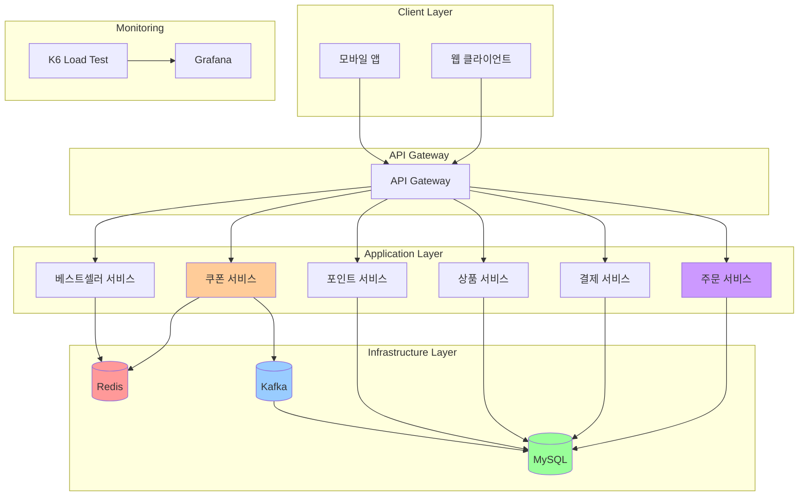
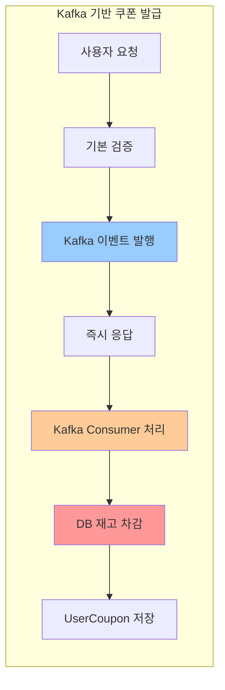
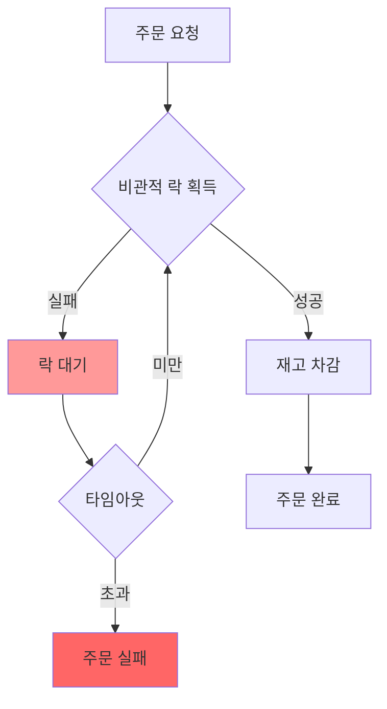
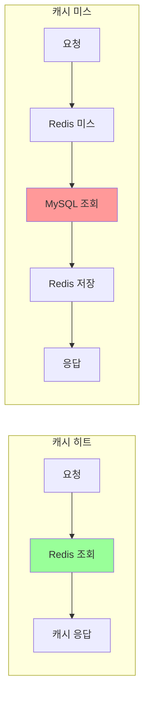
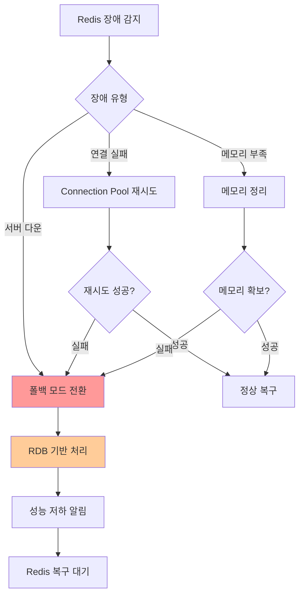
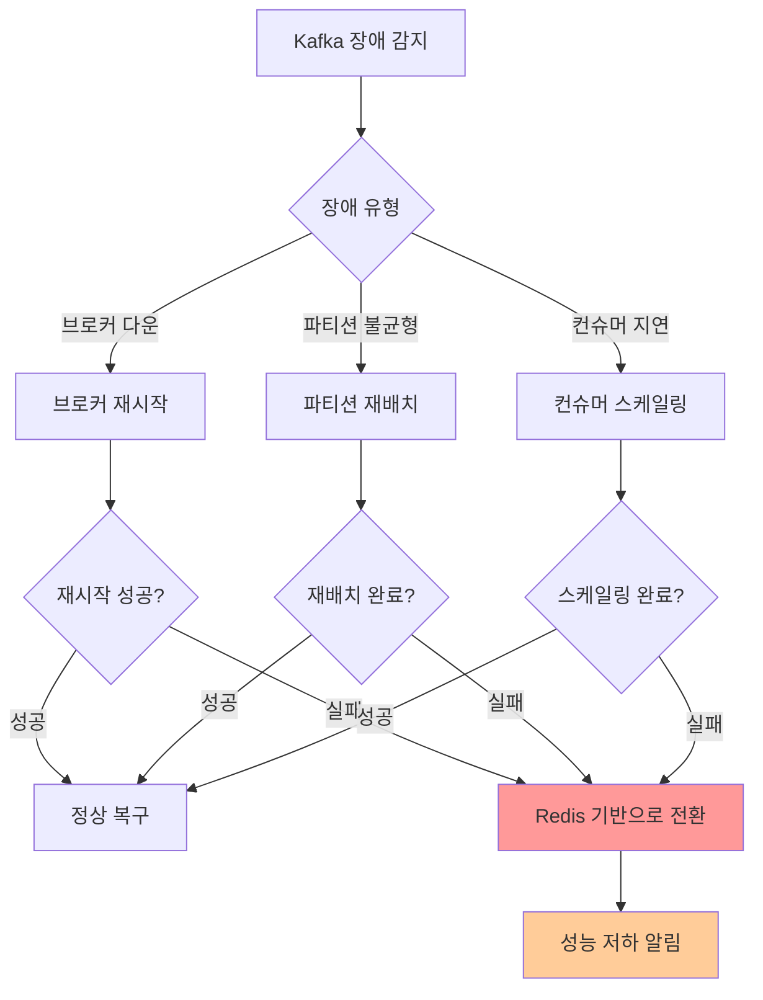
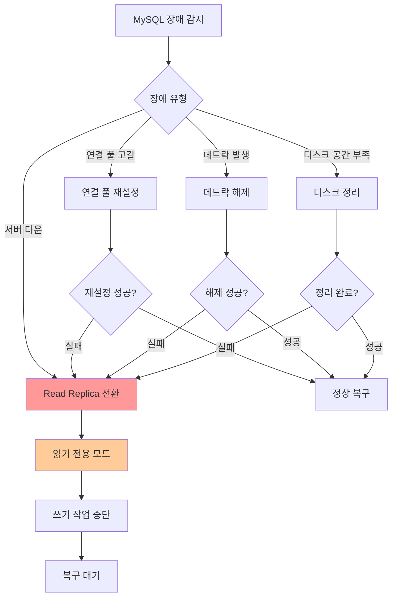
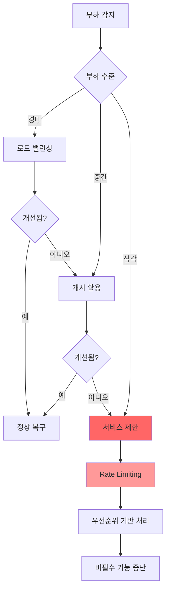
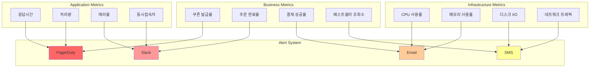
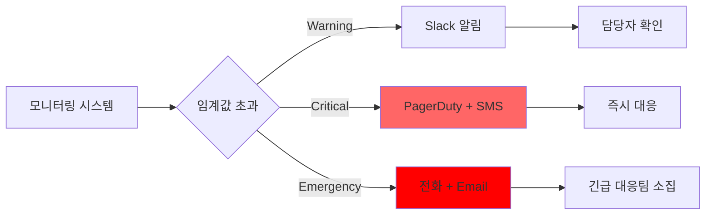

# 🚨 시스템 병목 탐색 및 장애 대응 매뉴얼

### 목적
- 본 문서는 시스템 병목 지점을 탐색하고, 장애 발생 시 효과적으로 대응하기 위한 매뉴얼입니다.
- 시스템 아키텍처, 병목 지점 분석, 장애 유형별 대응 방안, 모니터링 체계, 복구 절차 및 예방 조치를 포함합니다.
- 현재 시스템에 장애 대비가 미비한 상태이므로, 이 매뉴얼을 통해 병목 지점을 사전에 파악하고 대응 방안을 마련합니다.

## 📋 목차
1. [시스템 아키텍처 개요](#시스템-아키텍처-개요)
2. [주요 병목 지점 분석](#주요-병목-지점-분석)
3. [장애 유형별 대응 방안](#장애-유형별-대응-방안)
4. [모니터링 및 알림 체계](#모니터링-및-알림-체계)
5. [복구 절차](#복구-절차)
6. [예방 조치](#예방-조치)

---

## 🏗️ 시스템 아키텍처 개요

### 전체 시스템 구성도


### 핵심 컴포넌트별 역할

| 컴포넌트 | 역할 | 주요 기능 | 의존성 |
|---------|------|-----------|--------|
| **쿠폰 서비스** | 선착순 쿠폰 발급 | Redis/Kafka 기반 동시성 제어 | Redis, Kafka, MySQL |
| **주문 서비스** | 주문 처리 및 재고 관리 | 비관적 락 기반 재고 차감 | MySQL, Redis |
| **결제 서비스** | 결제 처리 | 분산락 기반 중복 결제 방지 | MySQL, Redis |
| **베스트셀러 서비스** | 실시간 랭킹 | Redis Sorted Set 기반 랭킹 | Redis, MySQL |
| **Redis** | 캐시 및 동시성 제어 | 세션, 랭킹, 분산락 | - |
| **Kafka** | 메시지 브로커 | 비동기 이벤트 처리 | - |
| **MySQL** | 메인 데이터베이스 | 트랜잭션 데이터 저장 | - |

---

## 🔍 주요 병목 지점 분석

### 1. 쿠폰 발급 시스템 병목

#### 현재 구현 방식 (Kafka 기반)


#### 예상 병목 지점
- **Kafka 파티션 경합**: 단일 파티션으로 인한 순차 처리 병목
- **Consumer 처리 지연**: DB 트랜잭션으로 인한 처리 지연
- **재고 차감 경합**: 동시 쿠폰 발급 시 DB 락 경합
- **네트워크 지연**: Kafka 메시지 전송 오버헤드

### 2. 주문 처리 시스템 병목

#### 비관적 락 처리 흐름


#### 예상 병목 지점
- **비관적 락 경합**: 동시 주문 시 락 대기 시간 증가
- **데이터베이스 I/O**: 재고 조회/업데이트 지연
- **트랜잭션 길이**: 주문-재고-결제 연쇄 처리
- **데드락 발생**: 복잡한 락 순서로 인한 데드락 위험

### 3. 베스트셀러 조회 시스템 병목

#### Redis 캐시 처리 흐름


#### 예상 병목 지점
- **캐시 미스**: Redis에 데이터가 없을 때 MySQL 조회 지연
- **캐시 동기화**: 주문 완료 시 베스트셀러 랭킹 업데이트 지연
- **메모리 부족**: Redis 메모리 한계로 인한 캐시 제거
- **네트워크 지연**: Redis 연결 지연

---

## 🚨 장애 유형별 대응 방안

### 1. Redis 장애 대응

#### 장애 시나리오


#### 대응 절차
1. **즉시 대응 (1-5분)**
   - Redis 연결 상태 확인
   - 메모리 사용량 체크
   - 로그 분석으로 원인 파악

2. **폴백 모드 전환 (5-10분)**
   - 쿠폰 발급: RDB 기반 낙관적 락으로 전환
   - 베스트셀러: RDB 기반 조회로 전환
   - 분산락: 데이터베이스 락으로 전환

3. **복구 작업 (10-30분)**
   - Redis 서버 재시작
   - 메모리 설정 최적화
   - 데이터 복구 및 검증

### 2. Kafka 장애 대응

#### 장애 시나리오


#### 대응 절차
1. **즉시 대응 (1-5분)**
   - Kafka 브로커 상태 확인
   - 파티션 리더/리플리카 상태 체크
   - 컨슈머 랙 모니터링

2. **대체 처리 모드 (5-15분)**
   - 쿠폰 발급: Redis 기반으로 전환
   - 이벤트 처리: 동기 처리로 전환
   - 성능 저하 알림 발송

3. **복구 작업 (15-60분)**
   - 브로커 재시작 및 복구
   - 파티션 재배치
   - 컨슈머 그룹 재조정

### 3. 데이터베이스 장애 대응

#### 장애 시나리오


#### 대응 절차
1. **즉시 대응 (1-5분)**
   - 데이터베이스 연결 상태 확인
   - 프로세스 리스트 및 락 상태 체크
   - 디스크 공간 및 메모리 사용량 확인

2. **읽기 전용 모드 (5-15분)**
   - 쓰기 작업 중단
   - 읽기 작업만 허용
   - 캐시 기반 서비스 우선 제공

3. **복구 작업 (15-60분)**
   - 데이터베이스 서버 재시작
   - 인덱스 재구성
   - 데이터 정합성 검증

### 4. 고부하 상황 대응

#### 부하 감지 및 대응


#### 대응 전략
1. **경미한 부하 (CPU 70-80%)**
   - 로드 밸런서 가중치 조정
   - 캐시 히트율 최적화
   - 불필요한 로그 레벨 조정

2. **중간 부하 (CPU 80-90%)**
   - Redis 캐시 활용도 증가
   - 데이터베이스 쿼리 최적화
   - 비동기 처리 우선 적용

3. **심각한 부하 (CPU 90%+)**
   - Rate Limiting 적용
   - 우선순위 기반 요청 처리
   - 비필수 기능 일시 중단

---

## 📊 모니터링 및 알림 체계

### 모니터링 대시보드 구성


### 주요 모니터링 지표

#### 1. 시스템 병목 지표
| 지표 | 임계값 | 알림 레벨 | 대응 방안 |
|------|--------|-----------|-----------|
| **Kafka Consumer 랙** | > 1000 | Warning | Consumer 스케일링 |
| **Redis 메모리 사용률** | > 85% | Critical | 메모리 정리 |
| **DB 락 대기 시간** | > 5초 | Critical | 락 분석 및 해제 |
| **캐시 히트율** | < 80% | Warning | 캐시 전략 검토 |

#### 2. 인프라 지표
| 지표 | 임계값 | 알림 레벨 | 대응 방안 |
|------|--------|-----------|-----------|
| **CPU 사용률** | > 80% | Warning | 리소스 확장 검토 |
| **메모리 사용률** | > 85% | Critical | 메모리 정리 |
| **디스크 사용률** | > 90% | Critical | 디스크 정리 |
| **네트워크 지연** | > 100ms | Warning | 네트워크 분석 |

#### 3. 비즈니스 지표
| 지표 | 임계값 | 알림 레벨 | 대응 방안 |
|------|--------|-----------|-----------|
| **쿠폰 발급 실패율** | > 10% | Critical | 쿠폰 시스템 점검 |
| **주문 실패율** | > 5% | Critical | 주문 시스템 점검 |
| **결제 실패율** | > 3% | Critical | 결제 시스템 점검 |
| **베스트셀러 조회 실패율** | > 15% | Warning | 캐시 시스템 점검 |

### 알림 체계


---

## 🔧 복구 절차

### 1. 자동 복구 절차

#### Redis 복구
```bash
# 1. Redis 연결 상태 확인
redis-cli ping

# 2. 메모리 사용량 확인
redis-cli info memory

# 3. 메모리 정리 (필요시)
redis-cli FLUSHDB

# 4. Redis 재시작
sudo systemctl restart redis

# 5. 데이터 복구 확인
redis-cli KEYS "*"
```

#### Kafka 복구
```bash
# 1. 브로커 상태 확인
kafka-topics.sh --bootstrap-server localhost:9092 --list

# 2. 파티션 상태 확인
kafka-topics.sh --bootstrap-server localhost:9092 --describe --topic coupon-issue

# 3. 컨슈머 랙 확인
kafka-consumer-groups.sh --bootstrap-server localhost:9092 --describe --group coupon-group

# 4. 브로커 재시작
sudo systemctl restart kafka

# 5. 파티션 재배치
kafka-reassign-partitions.sh --bootstrap-server localhost:9092 --reassignment-json-file reassignment.json --execute
```

#### MySQL 복구
```bash
# 1. 연결 상태 확인
mysql -u root -p -e "SELECT 1"

# 2. 프로세스 리스트 확인
mysql -u root -p -e "SHOW PROCESSLIST"

# 3. 락 상태 확인
mysql -u root -p -e "SHOW ENGINE INNODB STATUS"

# 4. 데드락 해제
mysql -u root -p -e "KILL [process_id]"

# 5. 데이터베이스 재시작
sudo systemctl restart mysql
```

#### 캐시 복구
```java
// Redis 캐시 초기화
@PostConstruct
public void initializeCache() {
    // 베스트셀러 랭킹 초기화
    bestSellerRankingService.initializeTodayRanking();
    
    // 쿠폰 발급 상태 초기화
    couponRedisService.clearAllCouponData();
    
    // 분산락 초기화
    distributedLockService.clearAllLocks();
}
```


### 2. 장애 대응 훈련

#### 정기 점검 일정
| 항목 | 주기 | 담당자 | 내용 |
|------|------|--------|------|
| **백업 복구 테스트** | 월 1회 | DBA | 데이터베이스 백업/복구 |
| **장애 시나리오 훈련** | 분기 1회 | 개발팀 | 실제 장애 상황 시뮬레이션 |
| **성능 테스트** | 월 1회 | QA팀 | 부하 테스트 및 성능 분석 |
| **보안 점검** | 월 1회 | 보안팀 | 취약점 스캔 및 패치 |

#### 장애 대응 체크리스트
- [ ] 장애 감지 및 알림 수신
- [ ] 장애 유형 및 영향도 판단
- [ ] 즉시 대응 조치 실행
- [ ] 관련 팀원 통보
- [ ] 장애 상황 문서화
- [ ] 복구 작업 실행
- [ ] 정상 동작 확인
- [ ] 사후 분석 및 개선점 도출

---

## 📞 긴급 연락처

### 기술 지원팀
| 역할 | 연락처 | 담당 영역 |
|------|--------|-----------|
| **시스템 관리자** | 010-1234-5678 | 인프라 장애 |
| **데이터베이스 관리자** | 010-2345-6789 | DB 장애 |
| **개발팀 리드** | 010-3456-7890 | 애플리케이션 장애 |
| **운영팀 매니저** | 010-4567-8901 | 전체 조율 |

### 외부 지원업체
| 업체 | 연락처 | 지원 범위 |
|------|--------|-----------|
| **클라우드 제공업체** | 1588-0000 | 인프라 장애 |
| **데이터베이스 전문업체** | 1588-1111 | DB 성능 최적화 |
| **보안 전문업체** | 1588-2222 | 보안 사고 대응 |

---

## 📝 장애 보고서 템플릿

### 장애 발생 보고서
```
장애 발생 일시: YYYY-MM-DD HH:MM:SS
장애 종료 일시: YYYY-MM-DD HH:MM:SS
장애 지속 시간: XX분 XX초

장애 유형: [시스템/네트워크/데이터베이스/애플리케이션]
장애 등급: [Critical/Warning/Info]

장애 증상:
- 구체적인 증상 설명
- 영향받은 서비스 목록
- 사용자 영향도

원인 분석:
- 장애 발생 원인
- 관련 로그 및 메트릭
- 근본 원인 분석

대응 과정:
- 즉시 대응 조치
- 복구 작업 내용
- 관련 팀 협업 내용

개선 사항:
- 재발 방지 대책
- 시스템 개선점
- 프로세스 개선점

담당자: [이름]
작성일: YYYY-MM-DD
```

---

## 🎯 결론 및 요약

### 현재 시스템 병목 현황
- **쿠폰 발급**: Kafka 파티션 경합 및 Consumer 처리 지연
- **주문 처리**: 비관적 락 경합 및 데드락 위험
- **베스트셀러**: 캐시 미스 및 동기화 지연
- **모니터링**: 병목 지점별 세밀한 모니터링 필요

### 우선순위별 병목 해결 계획

#### 1단계 (단기간 내)
- [ ] 주문 처리 시스템 락 최적화
- [ ] Kafka Consumer 스케일링
- [ ] Redis 캐시 전략 개선

#### 2단계 (1개월 내)
- [ ] 자동 복구 시스템 구축
- [ ] 병목 지점별 모니터링 강화
- [ ] 백업 복구 프로세스 개선

#### 3단계 (3개월 내)
- [ ] MSA 전환으로 서비스 분리
- [ ] 클라우드 네이티브 아키텍처 도입
- [ ] AI 기반 병목 예측 시스템 구축

이 매뉴얼을 통해 시스템의 병목 지점을 파악하고, 효과적인 장애 대응이 가능할 것으로 예상한다.
