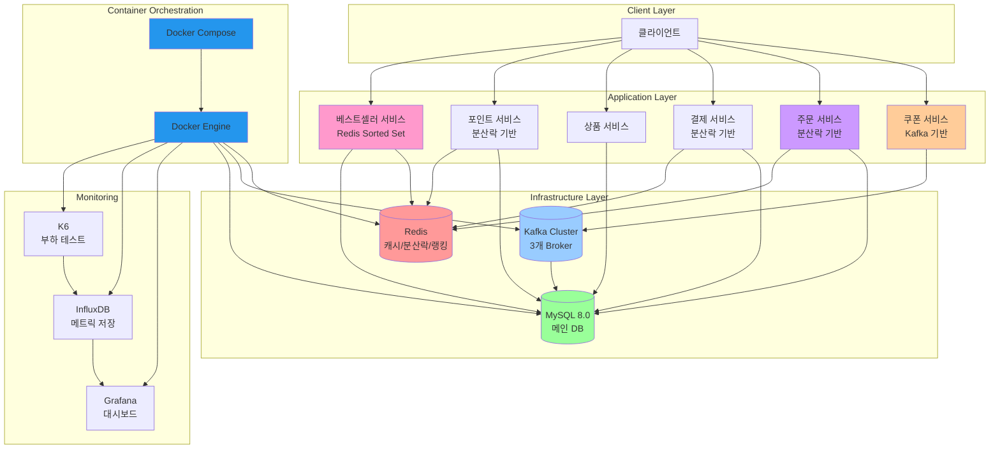

# 인프라 구성도

## 시스템 구성 요소

### 설명
- Redis는 상위 상품 캐싱 / 쿠폰 발급 시 선착순 중복 방지 용도로 사용합니다.
- 상위 상품(베스트셀러) 정보 갱신은 매일 자정 00:00에 진행됩니다.
- Kafka는 비동기 이벤트 처리 및 서비스 간 통신에 사용됩니다.
- 분산락은 Redisson을 사용하여 동시성 문제를 해결합니다.
- 모든 컴포넌트들은 Docker 컨테이너로 관리되며, Docker Compose를 통해 로컬 개발 환경을 구성합니다.