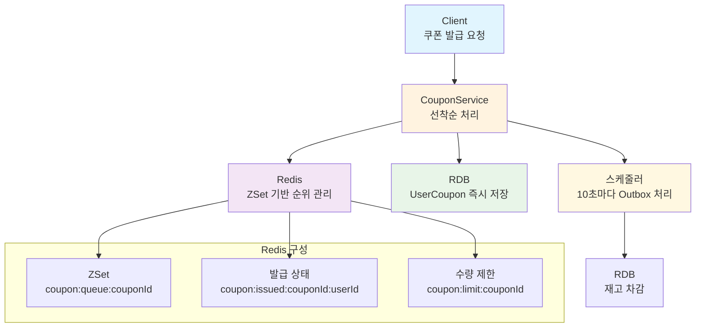
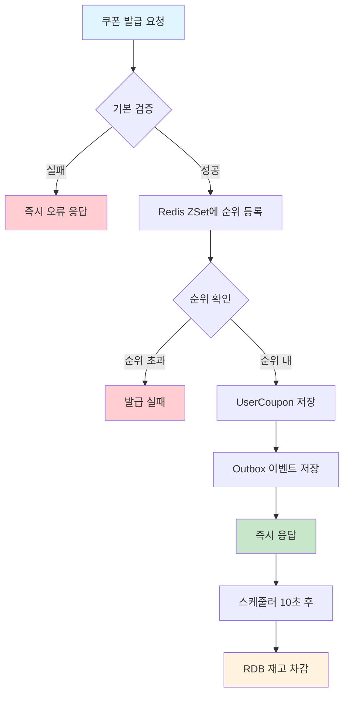
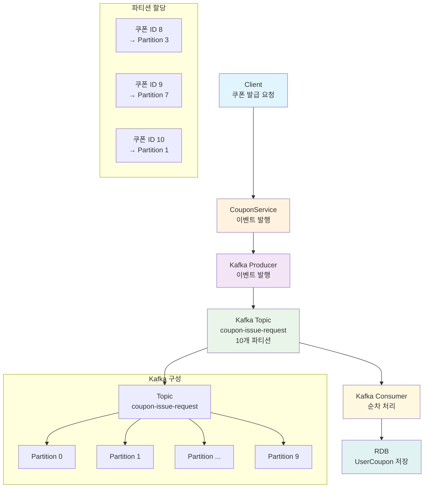
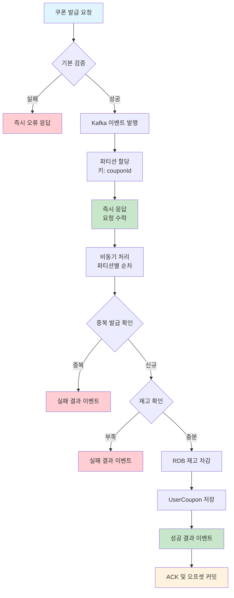
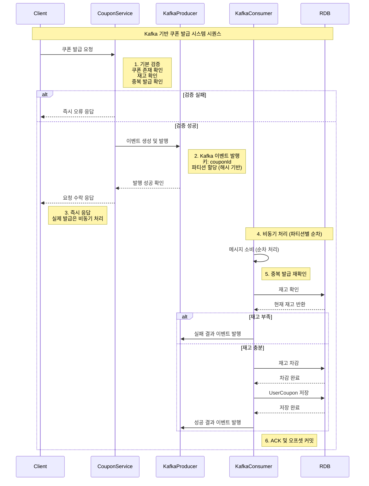

# 쿠폰 발급 시스템: Redis vs Kafka 기반 아키텍처 비교 분석

## 1. 개요

기존 프로젝트의 선착순 쿠폰 발급 시스템은 Redis ZSet을 활용한 동시성 제어와 스케줄링 기반 RDB 동기화 방식을 사용하고 있다.
이 문서에서는 Kafka를 활용한 개선 방안을 제시하고, 두 방식의 장단점을 비교 분석한다.

## 2. 기존 시스템 분석 (Redis 기반)

### 2.1 시스템 아키텍처

### 2.2 핵심 구성 요소

#### 2.2.1 CouponRedisService
- **ZSet 기반 순위 관리**: `coupon:queue:{couponId}` 키로 사용자별 발급 순위 관리
- **발급 상태 추적**: `coupon:issued:{couponId}:{userId}` 키로 중복 발급 방지
- **수량 제한 관리**: `coupon:limit:{couponId}` 키로 쿠폰 재고 제한

#### 2.2.2 CouponOutboxProcessor
- **스케줄링 기반 처리**: 10초마다 PENDING 이벤트 처리
- **재시도 메커니즘**: 실패한 이벤트 1분마다 재처리 (최대 3회)
- **RDB 재고 동기화**: 쿠폰 발급 시 RDB 재고 차감

### 2.3 처리 흐름

## 3. Kafka 기반 개선 시스템 설계

### 3.1 시스템 아키텍처

### 3.2 핵심 설계 원칙

#### 3.2.1 메시지 키 전략
- **키**: `couponId` (쿠폰 번호)
- **파티션 할당**: 같은 쿠폰의 모든 요청이 동일 파티션에 할당
- **순서 보장**: 파티션 내에서 순차 처리로 동시성 이슈 해결

#### 3.2.2 Consumer 설계
- **단일 Consumer Group**: 쿠폰 발급 전용 그룹
- **순차 처리**: 파티션별로 순서 보장
- **멱등성 보장**: 중복 발급 방지 로직

### 3.3 처리 흐름

## 4. 두 시스템 비교 분석 (이론)

### 4.1 성능 비교

| 항목 | Redis 기반 | Kafka 기반 |
|------|------------|------------|
| **처리 속도** | 매우 빠름 (메모리 기반) | 빠름 (네트워크 오버헤드) |
| **동시 처리량** | 높음 (Redis 성능) | 매우 높음 (파티션별 병렬) |
| **지연 시간** | 밀리초 단위 | 수십 밀리초 단위 |
| **확장성** | 수직 확장 | 수평 확장 (파티션 증가) |

### 4.2 동시성 제어 비교

| 항목 | Redis 기반 | Kafka 기반 |
|------|------------|------------|
| **동시성 제어** | ZSet 기반 순위 관리 | 파티션 기반 순서 보장 |
| **락 사용** | 암시적 락 (Redis 내부) | 락 불필요 |
| **순서 보장** | timestamp 기반 | 파티션 내 순차 처리 |
| **초과 발급 방지** | 순위 기반 검증 | 순차 처리로 자동 방지 |

### 4.3 안정성 비교

| 항목 | Redis 기반 | Kafka 기반 |
|------|------------|------------|
| **데이터 내구성** | 메모리 기반 (일부 손실 가능) | 디스크 기반 (높은 내구성) |
| **장애 복구** | 수동 복구 필요 | 자동 복구 (오프셋 기반) |
| **메시지 손실** | Redis 장애 시 손실 | 거의 없음 |
| **재처리** | 스케줄러 기반 | 오프셋 기반 자동 재처리 |

### 4.4 운영 복잡도 비교

| 항목 | Redis 기반 | Kafka 기반 |
|------|------------|------------|
| **인프라 복잡도** | 단순 (Redis만) | 복잡 (Kafka 클러스터) |
| **모니터링** | Redis 메트릭 | Kafka + Consumer 메트릭 |
| **장애 대응** | 단순 | 복잡 (분산 환경) |
| **학습 곡선** | 낮음 | 높음 |

## 5. 장단점 분석

### 5.1 Redis 기반 시스템

#### 5.1.1 장점
- **빠른 응답 속도**: 메모리 기반으로 밀리초 단위 처리
- **단순한 아키텍처**: Redis만으로 동시성 제어 가능
- **낮은 운영 복잡도**: 단일 컴포넌트 관리
- **즉시 결과 확인**: 실시간 순위 및 상태 조회 가능

#### 5.1.2 단점
- **데이터 손실 위험**: Redis 장애 시 메모리 데이터 손실
- **확장성 제한**: 수직 확장만 가능
- **복잡한 동기화**: RDB와 Redis 간 데이터 동기화 복잡
- **재처리 어려움**: 장애 복구 시 수동 처리 필요

### 5.2 Kafka 기반 시스템

#### 5.2.1 장점
- **높은 처리량**: 파티션별 병렬 처리로 확장성 우수
- **강력한 내구성**: 디스크 기반으로 데이터 손실 최소화
- **자동 재처리**: 오프셋 기반으로 장애 복구 자동화
- **순서 보장**: 파티션 내에서 순차 처리로 동시성 이슈 해결
- **느슨한 결합**: Producer와 Consumer 간 독립성

#### 5.2.2 단점
- **높은 지연 시간**: 네트워크 오버헤드로 인한 지연
- **복잡한 인프라**: Kafka 클러스터 운영 필요
- **높은 학습 곡선**: Kafka 개념 이해 및 설정 복잡
- **운영 비용**: 추가 인프라 및 모니터링 비용

## 6. 사용 시나리오별 권장사항

### 6.1 Redis 기반 시스템이 적합한 경우

- **소규모 시스템**: 사용자 수가 적고 트래픽이 낮은 경우
- **빠른 응답 필요**: 실시간 순위 확인이 중요한 경우
- **단순한 요구사항**: 복잡한 이벤트 처리가 불필요한 경우
- **제한된 리소스**: 인프라 비용을 최소화해야 하는 경우

### 6.2 Kafka 기반 시스템이 적합한 경우

- **대규모 시스템**: 높은 동시 접속자와 처리량이 필요한 경우
- **데이터 안정성**: 데이터 손실을 최소화해야 하는 경우
- **확장성 요구**: 향후 시스템 확장이 예상되는 경우
- **복잡한 이벤트 처리**: 다양한 후속 처리가 필요한 경우

## 7. 결론
### 개선 후 시퀀스 다이어그램

