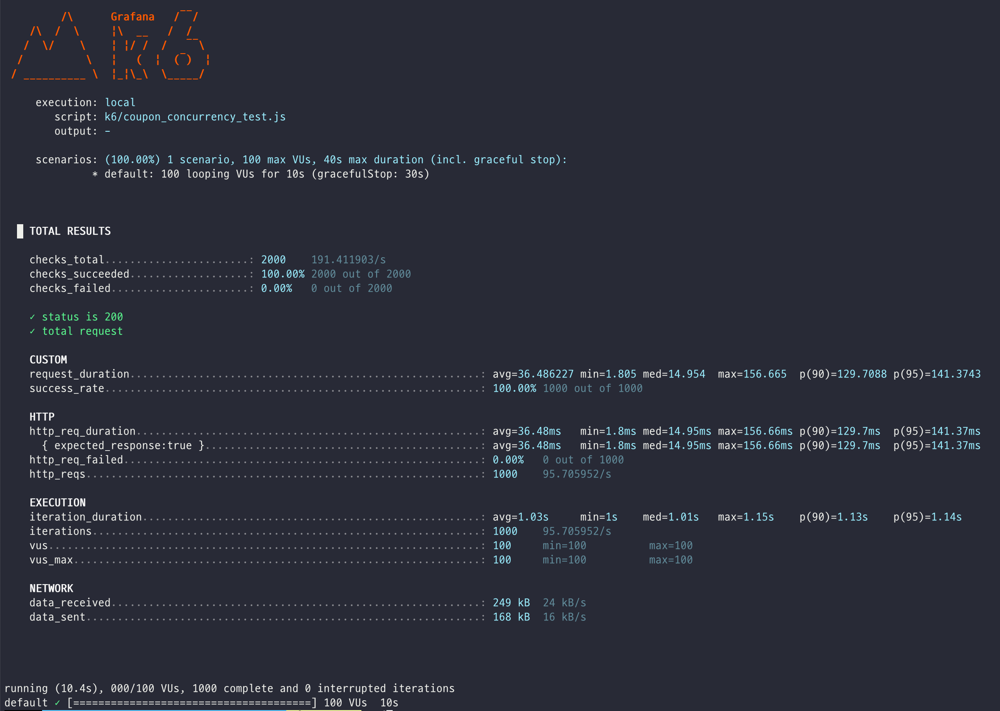
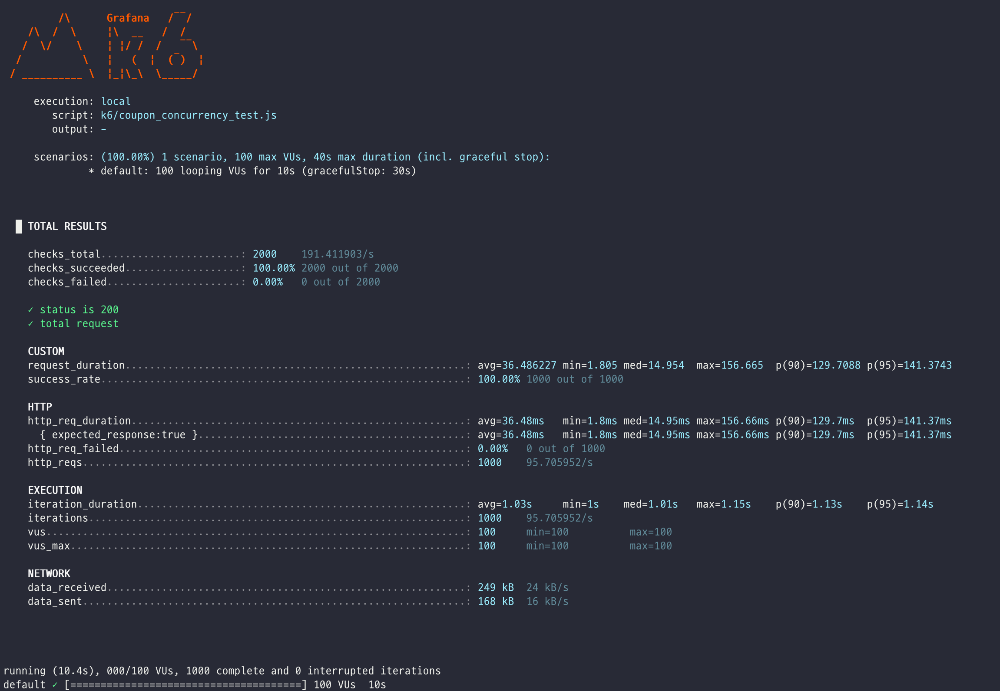
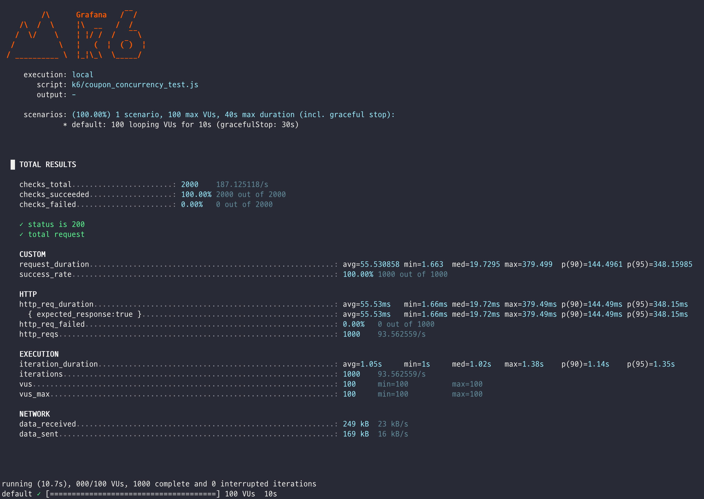
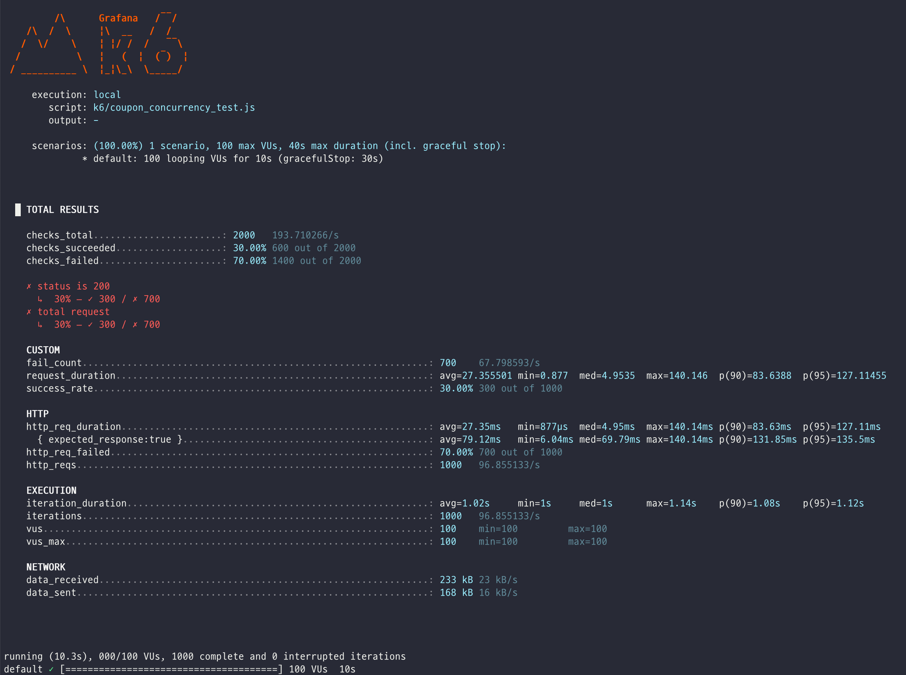

# 쿠폰 발급 시스템 Kafka 도입 결과

## 1. Redis vs Kafka 비교

#### Redis

#### Kafka

## 📊 결과 요약

| 항목                 | Redis 기반       | Kafka 기반       |
|----------------------|------------------|------------------|
| 평균 응답 시간       | 64.78ms          | **36.48ms** ✅     |
| 중앙값 (Median)      | 17.16ms          | 14.95ms          |
| 최대 응답 시간       | ❌ **673.65ms**   | **156.66ms** ✅   |
| P90                  | **97.12ms** ✅    | 129.70ms ❌       |
| P95                  | ❌ **478.56ms**   | **141.37ms** ✅   |
| 전체 성공률         | 100%             | 100%             |

### 🔴 Redis 기반

**✅ 장점**
- 평균 요청 속도가 빠르고 안정적임
- `P90` 기준 응답 시간이 100ms 이하로 **일관된 응답 성능**을 보임

**⚠️ 단점**
- 일부 요청에서 **비정상적으로 긴 지연** 발생
    - `최대 응답 시간`: **673ms**
    - `P95`: **478ms**
- Redis는 **싱글 스레드** 구조이므로, 순간적인 부하에서 병목 발생 가능성 있음

### 🟢 Kafka 기반

**✅ 장점**
- 평균 응답 속도가 Redis보다 **약 44% 더 빠름**
    - `avg`: **36ms (Kafka)** vs **64ms (Redis)**
- 고부하 상황에서도 일정 수준의 응답 시간 유지

**⚠️ 단점**
- `P90` 응답 시간이 Redis보다 **더 높음**
    - Kafka: **129ms**, Redis: **97ms**
- 메시지 큐 기반의 **비동기 처리 특성**으로 인해 일부 요청의 tail latency가 발생할 수 있음

## 2. Kafka 시스템 동시성 테스트 결과
### Case: Partition 수에 따른 성능 비교

#### Partition 1개

#### Partition 10개

## 📊 결과 요약

| 지표                | Partition 1개   | Partition 10개  | 변화 추이          |
| ----------------- | -------------- | -------------- | -------------- |
| 평균 응답 시간 (avg)    | 🟢 **36.48ms** | 🔴 **55.53ms** | ⬆ 약 **52% 증가** |
| 중앙값 (med)         | 14.95ms        | 19.73ms        | ⬆ 약간 증가        |
| 최대 응답 시간 (max)    | 156.66ms       | ❗ **379.49ms** | ⬆ 두 배 이상 증가    |
| P90               | 129.70ms       | 144.49ms       | ⬆ 증가           |
| P95               | 141.37ms       | ❗ **348.15ms** | ⬆ **2.4배 증가**  |
| 요청 실패율            | 0%             | 0%             | ✅ 동일           |
| 요청 수 (throughput) | 1000           | 1000           | ✅ 동일           |

### 🔵 Partition 1개

**✅ 장점**
- **평균 응답 시간과 tail latency(P95)** 가 **상대적으로 낮음**
- 단일 Partition 구조로 인해 **처리 순서가 보장되고**, **구조가 단순하여 컨트롤이 용이함**

**⚠️ 단점**
- **확장성에는 한계**가 있음 (동시 처리량이 Partition 수만큼 제한됨)

---

### 🟡 Partition 10개

**⚠️ 관찰된 문제점**
- **평균 응답 시간과 P95 latency가 눈에 띄게 증가**
    - `avg`: 36ms → **55ms**
    - `P95`: 141ms → **348ms**

**📌 원인 분석**
- Partition 수가 늘어나면 Kafka는 메시지를 **병렬로 처리**하지만, 다음과 같은 오버헤드가 발생할 수 있음:
    - **컨슈머 그룹 설정**이 적절하지 않으면 처리 분산이 비효율적
    - **메시지 순서 보장** 이슈로 인해 **재정렬 로직**이 필요할 수 있음
    - **I/O 자원 분산**과 **네트워크 병목** 발생 가능성
    - **일부 Partition에 부하가 집중**되면 전체 지연 증가

### Case: 쿠폰 재고 부족

쿠폰 재고가 300개가 있는 상황에서 동시성 처리가 정상적으로 작동하는 것 확인 완료!