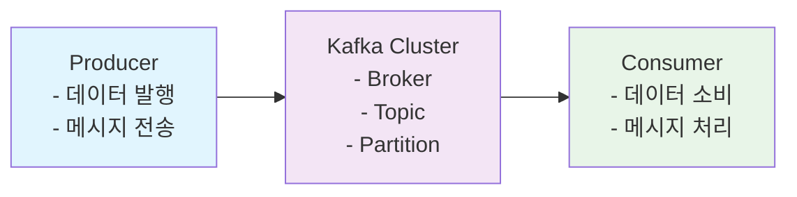
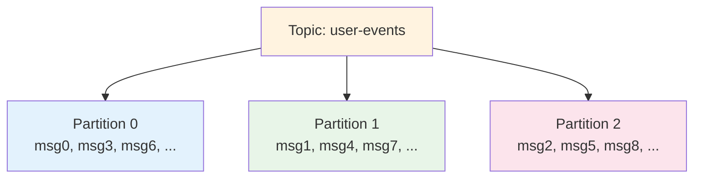
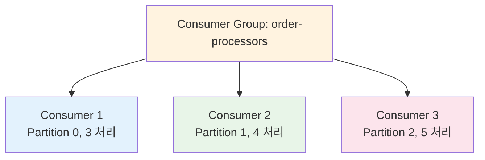
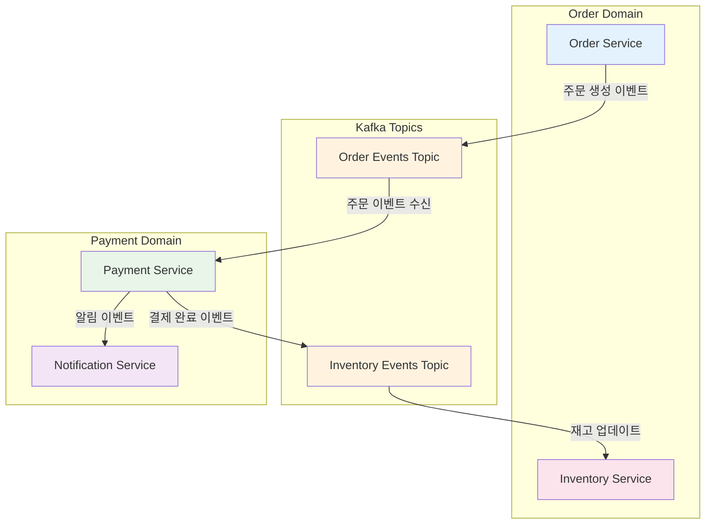
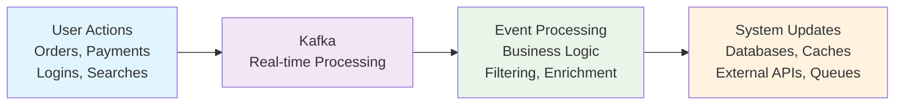
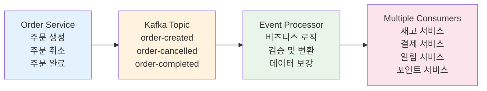

# Kafka 기초 개념 학습 노트

## 1. 이벤트 기반 시스템과 Kafka의 역할

### 1.1 이벤트 아이디어의 시스템 전체 확장

기존의 동기식 요청-응답 방식에서 벗어나 **이벤트 기반 아키텍처**로 전환하면 시스템 전체의 관점에서 많은 이점을 얻을 수 있다.

**기존 방식의 한계:**
- 서비스 간 강한 결합도
- 확장성 제약
- 장애 전파 위험
- 실시간 처리의 어려움

**이벤트 기반 방식의 장점:**
- 느슨한 결합 (Loosely Coupled)
- 독립적인 확장 가능
- 장애 격리
- 실시간 데이터 처리

### 1.2 Kafka가 해결하는 문제들

| 문제 상황 | 기존 해결책 | Kafka를 통한 해결책 |
|-----------|-------------|-------------------|
| 서비스 간 데이터 동기화 | REST API 호출 | 이벤트 발행/구독 |
| 대용량 데이터 처리 | 배치 처리 | 실시간 스트림 처리 |
| 장애 복구 | 재시작 후 재처리 | 오프셋 기반 재처리 |
| 데이터 백업 | 주기적 스냅샷 | 지속적 복제 |

## 2. Kafka의 핵심 특징

### 2.1 분산 스트리밍 플랫폼

Kafka는 **분산 스트리밍 플랫폼**으로, 실시간 데이터 파이프라인과 스트리밍 애플리케이션을 구축할 수 있게 해준다.

**주요 특징:**
- **고성능**: 초당 수백만 메시지 처리
- **확장성**: 수평적 확장 가능
- **내구성**: 디스크 기반 저장으로 데이터 손실 방지
- **실시간**: 지연 시간 최소화

### 2.2 Kafka 아키텍처 구성요소

## 3. Kafka의 주요 구성요소

### 3.1 핵심 개념들

| 구성요소 | 설명 | 역할 |
|----------|------|------|
| **Producer** | 데이터를 발행하는 클라이언트 | 메시지 생산 및 전송 |
| **Consumer** | 데이터를 소비하는 클라이언트 | 메시지 수신 및 처리 |
| **Broker** | Kafka 서버 인스턴스 | 메시지 저장 및 전달 |
| **Topic** | 메시지의 논리적 그룹 | 카테고리별 메시지 분류 |
| **Partition** | Topic의 물리적 분할 | 병렬 처리 및 확장성 |
| **Offset** | 메시지의 위치 정보 | 소비 위치 추적 |

### 3.2 Topic과 Partition 구조

**Partition의 장점:**
- **병렬 처리**: 여러 Consumer가 동시에 처리 가능
- **확장성**: Partition 수 증가로 처리량 향상
- **순서 보장**: 같은 Partition 내에서만 순서 보장

## 4. Kafka 사용 시 장단점

### 4.1 장점

#### 4.1.1 성능적 장점
- **고처리량**: 초당 수백만 메시지 처리
- **낮은 지연시간**: 밀리초 단위 응답
- **수평적 확장**: Broker 추가로 용량 확장

#### 4.1.2 아키텍처적 장점
- **느슨한 결합**: Producer와 Consumer 간 독립성
- **장애 격리**: 한 서비스 장애가 전체에 영향 없음
- **확장성**: 독립적인 서비스 확장 가능

#### 4.1.3 데이터 관리 장점
- **내구성**: 디스크 기반으로 데이터 손실 방지
- **재처리**: Offset 기반으로 과거 데이터 재처리 가능
- **백업**: 자동 복제로 데이터 안정성 확보

### 4.2 단점

#### 4.2.1 복잡성
- **학습 곡선**: 개념 이해와 설정이 복잡
- **운영 복잡도**: 클러스터 관리 및 모니터링 필요
- **디버깅 어려움**: 분산 환경에서 문제 추적 복잡

#### 4.2.2 기술적 제약
- **순서 보장 한계**: Partition 간 순서 보장 불가
- **메시지 크기**: 기본 1MB 제한 (설정 가능)
- **메시지 보존**: 디스크 공간에 따른 보존 기간 제한

#### 4.2.3 운영 비용
- **인프라 비용**: 추가 서버 및 스토리지 필요
- **인력 비용**: Kafka 전문가 필요
- **모니터링 비용**: 추가 모니터링 도구 필요

## 5. Kafka의 핵심 기능

### 5.1 메시지 전달 보장

| 전달 보장 수준 | 설명 | 장단점 |
|----------------|------|--------|
| **At most once** | 최대 한 번 전달 | 빠르지만 데이터 손실 가능 |
| **At least once** | 최소 한 번 전달 | 안전하지만 중복 가능 |
| **Exactly once** | 정확히 한 번 전달 | 완벽하지만 성능 저하 |

### 5.2 Consumer Group

**Consumer Group의 역할:**
- **부하 분산**: Partition을 Consumer 간 분배
- **확장성**: Consumer 추가/제거로 처리량 조절
- **장애 복구**: Consumer 장애 시 자동 재배치

### 5.3 데이터 보존 정책

| 정책 | 설명 | 사용 사례 |
|------|------|-----------|
| **Time-based** | 시간 기준 보존 | 로그 데이터 |
| **Size-based** | 크기 기준 보존 | 디스크 공간 절약 |
| **Compaction** | 키 기준 압축 | 최신 상태만 유지 |

## 6. 실제 사용 시나리오 예시

### 6.1 마이크로서비스 간 통신

### 6.2 백엔드 시스템 이벤트 처리 파이프라인

| 이벤트 타입 | 처리 로직 | 결과 액션 |
|-------------|-----------|-----------|
| **주문 생성** | 재고 확인, 결제 검증 | 재고 차감, 결제 처리, 알림 발송 |
| **사용자 로그인** | 세션 생성, 권한 확인 | 세션 저장, 접속 로그 기록 |
| **상품 조회** | 조회수 증가, 추천 알고리즘 | 인기도 업데이트, 추천 데이터 생성 |
| **결제 완료** | 포인트 적립, 쿠폰 사용 | 포인트 업데이트, 쿠폰 상태 변경 |

**실제 구현 예시:**

## 7. Kafka 도입 시 고려사항

### 7.1 기술적 고려사항

| 고려사항 | 세부 내용 | 해결 방안 |
|----------|-----------|-----------|
| **메시지 순서** | Partition 간 순서 보장 불가 | 비즈니스 로직에서 처리 |
| **중복 처리** | At least once 전달로 인한 중복 | 멱등성 보장 설계 |
| **데이터 일관성** | 분산 환경에서의 일관성 | Saga 패턴 등 활용 |
| **모니터링** | 분산 환경 모니터링 | Prometheus, Grafana 등 |

### 7.2 운영적 고려사항

| 영역 | 고려사항 | 대응 방안 |
|------|----------|-----------|
| **인프라** | 클러스터 크기 및 구성 | 부하 테스트 기반 설계 |
| **보안** | 데이터 암호화 및 인증 | SSL/TLS, SASL 설정 |
| **백업** | 데이터 백업 및 복구 | 정기적 백업 및 복구 테스트 |
| **모니터링** | 성능 및 상태 모니터링 | 종합적 모니터링 체계 |

## 8. 결론

Kafka는 현대 분산 시스템에서 **이벤트 기반 아키텍처**를 구현하기 위한 핵심 기술이다.
이벤트 중심의 사고방식을 통해 시스템의 확장성과 유연성을 높일 수 있으며, 다양한 비즈니스 요구사항에 맞춰 활용할 수 있다.
그러나 Kafka를 도입할 때는 기술적, 운영적 고려사항을 충분히 이해하고 준비해야 한다. 고성능인 만큼, 복잡성과 운영 비용이 증가할 수 있으므로, 적절한 설계와 모니터링 체계를 갖추는 것이 중요하다.
Kafka를 사용할 만큼의 규모 시스템이 아닌 경우에는 Redis Pub/Sub이나 RabbitMQ와 같은 비교적 경량인 메시징 시스템을 고려할 수도 있다.

**주요 학습 포인트:**
1. **이벤트 기반 사고**: 시스템 전체 관점에서의 이벤트 처리
2. **장단점 균형**: 성능과 복잡성의 트레이드오프 이해
3. **실용적 접근**: 비즈니스 요구사항에 맞는 적절한 활용

