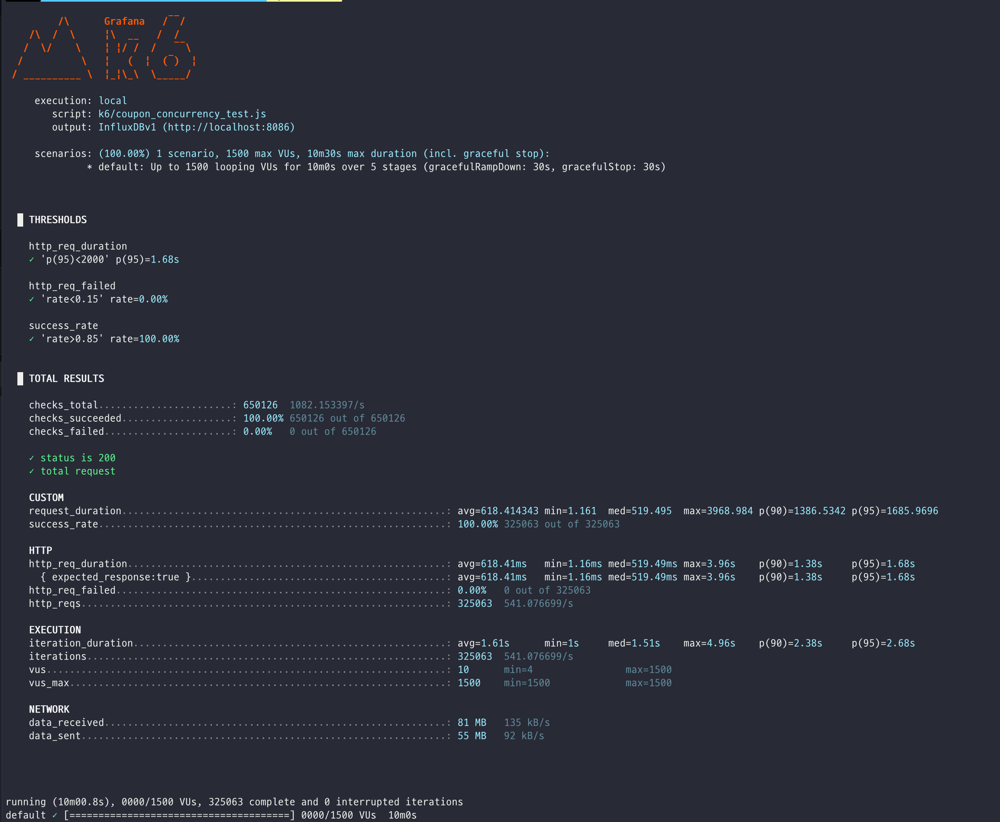
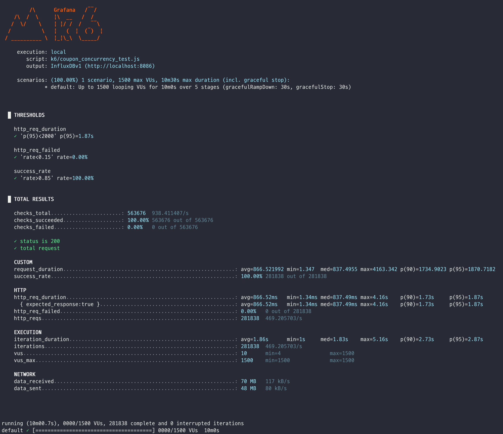

# 쿠폰 발급 시스템 부하 테스트 보고서

## 테스트 목적
쿠폰 발급 시스템의 성능과 안정성을 평가하기 위한 부하 테스트를 수행하고, 결과를 분석하여 개선점을 도출한다.
쿠폰 발급의 경우 순간적인 트래픽이 발생할 수 있으므로, 시스템이 높은 부하에서도 안정적으로 동작하는지 확인하는 것이 중요함.

## 테스트 환경
- **테스트 서버**: 쿠폰 발급 시스템이 배포된 서버
- **테스트 도구**: k6
- **테스트 기간**: 2025년 07월 23일 ~ 2023년 07월 25일
- **테스트 대상**: 쿠폰 발급 API
- **테스트 결과 적재 도구**: InfluxDB
- **시각화 도구**: Grafana
- **테스트 반복 횟수**: 5회

## 테스트 정보
### 테스트 요청 구성
- **API 엔드포인트**: `/api/v1/coupons`
- **HTTP 메서드**: POST
- **요청 데이터**: 
  - userId: 가상 사용자별 고유 ID (VU * 100000 + ITER + 1)
  - couponId: 8~13 중 랜덤 선택
- **요청 간격**: 1초 대기
- **성공 판정**: HTTP 200 (성공) 또는 409 (중복 발급)

### 시나리오
- **단계별 부하 증가**:
    - 0~2분: 500명으로 증가
    - 2~4분: 1000명으로 증가
    - 4~7분: 1500명으로 증가
    - 7~9분: 1000명으로 감소
    - 9~10분: 0명으로 종료
- **성능 기준**:
    - 응답 시간: P95 요청이 2초 이내
    - 실패율: 15% 미만
    - 성공률: 85% 이상

## 개선 시도 사항
1. 카프카의 파티션과 컨슈머의 개수를 증가시켜 병렬 처리 성능을 향상시킨다.
   - 기존의 1개에서 3개로 증가시킨다. &rarr; Why?: 브로커의 개수가 3개이므로 파티션과 컨슈머의 개수도 3개로 맞추어 리드 분배에 있어 균형을 맞춘다. 또한 과도한 
        병렬 처리는 오히려 성능 저하를 초래할 수 있으므로, 브로커 개수와 일치시켜 최적의 성능을 유지한다. 
2. 카프카의 프로듀서 설정을 추가로 조정하여 메시지 전송 성능을 최적화한다. (배치 사이즈, 배치 대기 시간 등)
    - `batch.size`를 32KB로 설정하고, `linger.ms`를 5ms로 설정한다. &rarr; Why?: 배치 사이즈를 늘리고 대기 시간을 조정하여 메시지 전송 성능을 향상시킨다. 
      이는 카프카의 프로듀서가 더 많은 메시지를 한 번에 전송할 수 있도록 하여 네트워크 오버헤드를 줄이고, 전송 속도를 높인다.
3. 쿠폰 발급 시 불필요한 로그 출력을 줄이기 위해 `logging.info()`를 `logging.debug()`로 변경한다.
   - Why?: 쿠폰 발급 시 발생하는 로그가 많아 시스템의 성능에 영향을 미칠 수 있으므로, 디버그 레벨로 변경하여 불필요한 로그 출력을 줄인다.

## 테스트 결과
### 초기 구현 단계

### 개선 시도

### 성능 비교 분석

| 지표 | 초기 구현 단계 | 개선 시도 후 | 변화율 |
|------|---------------|-------------|--------|
| **총 요청 수** | 325,063 | 281,838 | ▼ -13.3% |
| **요청 처리율** | 541.08 req/s | 469.21 req/s | ▼ -13.3% |
| **평균 응답 시간** | 618.41ms | 866.52ms | ▲ +40.1% |
| **P95 응답 시간** | 1.68s | 1.87s | ▲ +11.3% |
| **최대 응답 시간** | 3.96s | 4.16s | ▲ +5.1% |
| **성공률** | 100.00% | 100.00% | - |
| **실패율** | 0.00% | 0.00% | - |
| **데이터 수신량** | 81 MB | 70 MB | ▼ -13.6% |
| **데이터 전송량** | 55 MB | 48 MB | ▼ -12.7% |

### 상세 분석

#### 1. 처리 성능 저하
- **요청 처리율**: 541.08 req/s에서 469.21 req/s로 13.3% 감소
- **총 요청 수**: 325,063개에서 281,838개로 13.3% 감소
- **원인 분석**: 카프카 파티션과 컨슈머 증가로 인한 오버헤드 발생

#### 2. 응답 시간 증가
- **평균 응답 시간**: 618.41ms에서 866.52ms로 40.1% 증가
- **P95 응답 시간**: 1.68s에서 1.87s로 11.3% 증가
- **최대 응답 시간**: 3.96s에서 4.16s로 5.1% 증가
- **원인 분석**:
    - 카프카 설정 변경으로 인한 메시지 처리 지연
    - 배치 사이즈 증가로 인한 대기 시간 증가

#### 3. 안정성 유지
- **성공률**: 두 경우 모두 100% 유지
- **실패율**: 두 경우 모두 0% 유지
- **결론**: 시스템 안정성은 개선 시도 후에도 동일하게 유지되었으나 성능이 저하되었음 확인

## 결론 및 개선 사항
- 쿠폰 발급 시 logging.info()를 logging.debug()로 변경하여 로그 레벨을 낮추고, 불필요한 로그 출력을 줄이는 것 외에 수정 사항 없음