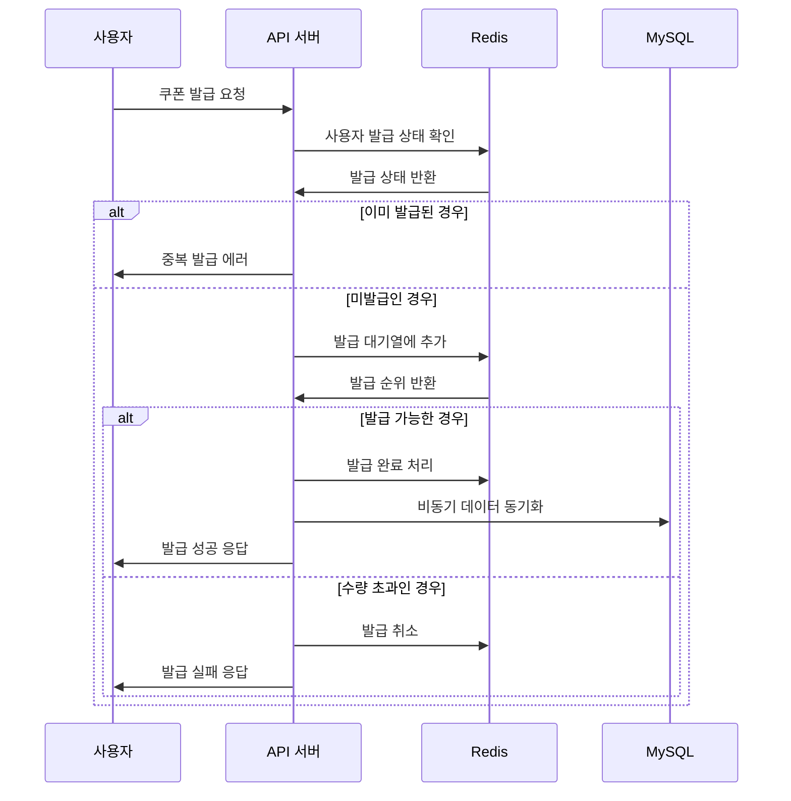
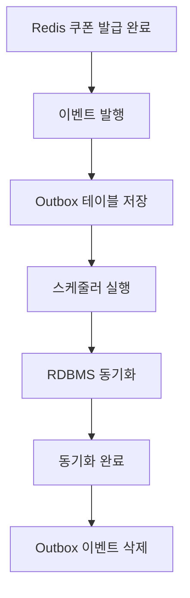

# 선착순 쿠폰 발급 동시성 처리 설계 개선

## 1. 개요

선착순 쿠폰 발급 기능을 Redis의 자료구조를 활용하여 동시성 문제를 해결하고, 보다 높은 처리량과 빠른 응답 시간을 제공하는 시스템으로 개선하는 것을 목표로 한다. 기존의 낙관적 락과 분산락 방식에서 Redis 기반 방식으로 전환하여 성능과 확장성을 향상시킬 수 있다.

## 2. 핵심 요구사항

- **선착순 보장**: 쿠폰 수량 제한 내에서 정확한 선착순 발급 보장
- **동시성 처리**: 다수의 사용자가 동시에 요청해도 데이터 정합성 유지
- **높은 처리량**: 초당 수천 건의 쿠폰 발급 요청 처리
- **빠른 응답**: 쿠폰 발급 성공/실패 여부를 즉시 응답
- **장애 대응**: Redis 장애 시에도 안정적인 서비스 제공

## 3. 기존 방식 vs Redis 방식 비교

### 3.1 기존 방식 (낙관적 락 + 분산락)

#### 3.1.1 구현 방식
- **낙관적 락**: JPA @Version을 활용한 버전 기반 동시성 제어
- **분산락**: Redisson을 활용한 분산 환경에서의 락 처리
- **데이터베이스 중심**: 모든 쿠폰 발급 로직이 RDBMS에서 처리

#### 3.1.2 장점
- **데이터 정합성**: ACID 트랜잭션으로 강력한 일관성 보장
- **복잡한 비즈니스 로직**: 복잡한 쿠폰 발급 규칙 처리 가능
- **장애 복구**: 데이터베이스 로그를 통한 정확한 복구

#### 3.1.3 단점
- **성능 병목**: 데이터베이스 락으로 인한 처리량 제한
- **확장성 한계**: 단일 데이터베이스의 처리 한계
- **응답 지연**: 락 대기 시간으로 인한 응답 지연
- **리소스 낭비**: 실패한 요청에 대한 리소스 낭비

### 3.2 Redis 방식

#### 3.2.1 구현 방식
- **Redis 자료구조**: Sorted Set 또는 List를 활용한 원자적 연산
- **메모리 기반**: 빠른 메모리 접근으로 높은 처리량
- **비동기 동기화**: Redis와 RDBMS 간 비동기 데이터 동기화

#### 3.2.2 장점
- **높은 처리량**: 초당 수만 건의 쿠폰 발급 처리 가능
- **빠른 응답**: 메모리 기반 처리로 밀리초 단위 응답
- **확장성**: Redis Cluster로 수평 확장 가능
- **원자적 연산**: Redis 명령어의 원자성으로 동시성 보장

#### 3.2.3 단점
- **메모리 제약**: Redis 메모리 용량에 따른 제약
- **복잡한 로직**: 복잡한 비즈니스 로직 구현의 어려움
- **데이터 지속성**: 메모리 기반으로 인한 데이터 손실 위험
- **동기화 오버헤드**: Redis-RDBMS 간 데이터 동기화 복잡성

## 4. Redis 자료구조별 설계

### 4.1 Sorted Set 방식

#### 4.1.1 키 구조
```
coupon:queue:{couponId}
```

**예시**: `coupon:queue:1001`

#### 4.1.2 데이터 구조
- **Score**: 발급 순서 (timestamp)
- **Member**: 사용자 ID

**예시**:
```
coupon:queue:1001
├── user:123 → 1703123456789 (발급 시간)
├── user:456 → 1703123456790
├── user:789 → 1703123456791
└── user:101 → 1703123456792
```

#### 4.1.3 주요 Redis 명령어
```redis
# 쿠폰 발급 시도
ZADD coupon:queue:1001 1703123456789 user:123

# 발급 순서 확인
ZCARD coupon:queue:1001

# 발급 성공 여부 확인 (수량 제한: 100개)
ZRANK coupon:queue:1001 user:123
```

#### 4.1.4 발급 로직
```java
// 1. 쿠폰 발급 시도
Long rank = redisTemplate.opsForZSet().add(couponKey, userId, System.currentTimeMillis());

// 2. 발급 순서 확인
Long userRank = redisTemplate.opsForZSet().rank(couponKey, userId);

// 3. 수량 제한 확인
if (userRank != null && userRank < couponLimit) {
    // 발급 성공
    return SUCCESS;
} else {
    // 발급 실패 - Redis에서 제거
    redisTemplate.opsForZSet().remove(couponKey, userId);
    return FAILED;
}
```

### 4.2 List 방식

#### 4.2.1 키 구조
```
coupon:queue:{couponId}:pending
coupon:queue:{couponId}:issued
```

**예시**: 
- `coupon:queue:1001:pending`
- `coupon:queue:1001:issued`

#### 4.2.2 데이터 구조
- **Pending List**: 발급 대기 중인 사용자 ID
- **Issued List**: 발급 완료된 사용자 ID

#### 4.2.3 주요 Redis 명령어
```redis
# 발급 시도
LPUSH coupon:queue:1001:pending user:123

# 발급 처리
LPOP coupon:queue:1001:pending
RPUSH coupon:queue:1001:issued user:123

# 발급 완료 수 확인
LLEN coupon:queue:1001:issued
```

#### 4.2.4 발급 로직
```java
// 1. 발급 대기열에 추가
redisTemplate.opsForList().leftPush(pendingKey, userId);

// 2. 발급 처리 (원자적 연산)
String issuedUserId = redisTemplate.opsForList().rightPopAndLeftPush(
    pendingKey, issuedKey, timeout, TimeUnit.SECONDS
);

// 3. 발급 완료 수 확인
Long issuedCount = redisTemplate.opsForList().size(issuedKey);

if (issuedUserId != null && issuedCount <= couponLimit) {
    return SUCCESS;
} else {
    // 수량 초과 시 발급 취소
    redisTemplate.opsForList().rightPopAndLeftPush(issuedKey, pendingKey);
    return FAILED;
}
```

## 5. Sorted Set 방식 채택

### 5.1 선택 이유
- **정확한 순서 보장**: timestamp 기반으로 정확한 선착순 보장
- **중복 발급 방지**: 동일 사용자의 중복 발급 시도 방지
- **실시간 순위 확인**: 사용자의 발급 순위를 실시간으로 확인 가능
- **확장성**: 추가 기능 구현 시 유연한 확장 가능

### 5.2 상세 구현 설계

#### 5.2.1 키 구조
```
coupon:queue:{couponId}          # 발급 대기열 (Sorted Set)
coupon:issued:{couponId}:{userId} # 사용자별 발급 상태 (String)
```

#### 5.2.2 발급 프로세스


## 6. 비동기 데이터 동기화

### 6.1 동기화 전략
- **Outbox Pattern**: Redis 발급 완료 → 이벤트 발행 → RDBMS 동기화
- **배치 처리**: 일정 시간 간격으로 배치 동기화
- **장애 복구**: 동기화 실패 시 재시도 메커니즘

### 6.2 동기화 프로세스


## 7. 장애 대응 및 모니터링

### 7.1 장애 대응
- **Redis 장애**: RDBMS 기반 폴백 처리
- **동기화 실패**: 재시도 큐를 통한 복구
- **데이터 불일치**: 주기적인 데이터 검증 및 복구

### 7.2 모니터링 지표
- **Redis 메모리 사용량**: 쿠폰 대기열 크기 모니터링
- **발급 처리량**: 초당 쿠폰 발급 건수
- **응답 시간**: 쿠폰 발급 API 응답 시간
- **동기화 지연**: Redis-RDBMS 동기화 지연 시간

## 8. 성능 최적화 방안

### 8.1 Redis 최적화
- **Pipeline 사용**: 여러 Redis 명령어 배치 처리
- **Connection Pool**: Redis 연결 풀 최적화
- **메모리 관리**: TTL 설정으로 메모리 사용량 제어

### 8.2 애플리케이션 최적화
- **비동기 처리**: 쿠폰 발급 후 비동기 동기화
- **캐시 활용**: 쿠폰 정보 캐싱으로 DB 조회 최소화
- **로드 밸런싱**: Redis Cluster를 통한 부하 분산

## 9. 확장성 고려사항

### 9.1 수평 확장
- **Redis Cluster**: 다중 Redis 노드로 처리량 확장
- **지역별 분산**: 지역별 Redis 인스턴스 구성

### 9.2 기능 확장
- **다양한 쿠폰 타입**: 할인율, 정액 할인 등 쿠폰 타입별 처리
- **사용자별 제한**: 사용자별 쿠폰 발급 제한 기능
- **통계 기능**: 실시간 쿠폰 발급 통계 제공

## 10. 결론

Redis 기반의 선착순 쿠폰 발급 시스템은 기존의 낙관적 락과 분산락 방식을 보완하고 보다 나은 성능을 기대할 수 있다.
Sorted Set을 활용한 정확한 순서 보장과 비동기 데이터 동기화를 통해 높은 처리량과 데이터 정합성을 동시에 만족하는 효율적인 시스템을 구축할 수 있습니다.
특히 대용량 트래픽 환경에서의 쿠폰 발급 서비스에 적합하며, Redis의 원자적 연산과 메모리 기반 처리로 사용자에게 빠르고 정확한 쿠폰 발급 경험을 제공할 수 있습니다.
다만 스케줄링을 통한 데이터 동기화와 장애 대응 방안을 충분히 고려하여 안정적인 운영이 가능하도록 신경써야 할 것들이 더 많다고 느꼈다.
