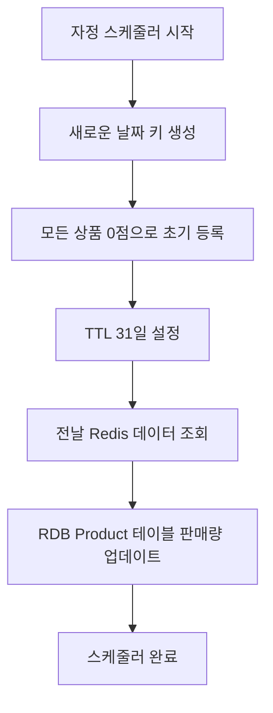
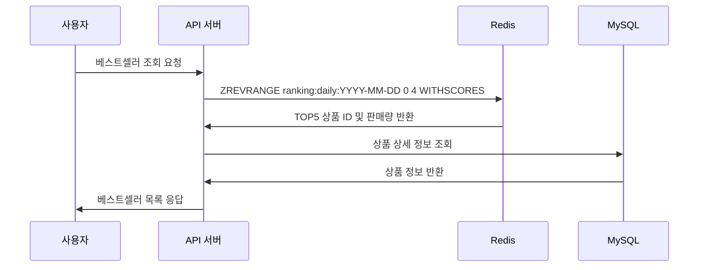
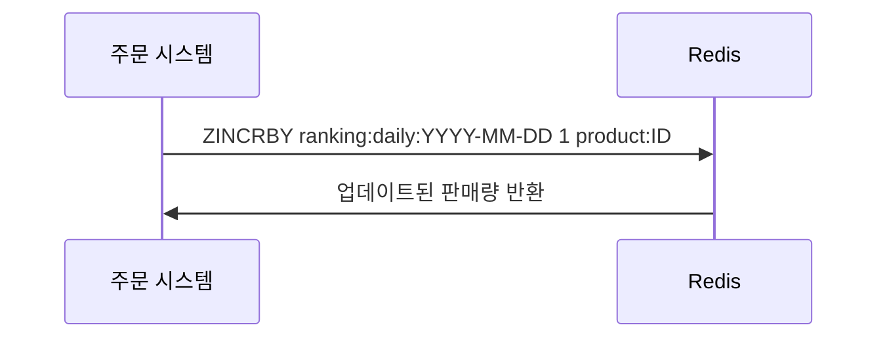

# 베스트셀러 (판매량 TOP5) 조회 설계

## 1. 개요

베스트셀러 조회 기능은 Redis의 Sorted Set 자료구조를 활용하여 실시간으로 당일 판매량 TOP5 상품을 제공하는 시스템

## 2. 핵심 요구사항

- **실시간 베스트셀러 조회**: 사용자 서비스 진입 시 당일 판매량 TOP5 상품 제공
- **실시간 반영**: 주문 및 결제 발생 시 즉시 판매량 집계 반영
- **일별 집계**: 매일 자정 RDBMS에 판매량 데이터 반영
- **월별 보관**: Redis 데이터 31일 TTL 설정으로 월별 베스트셀러 집계 준비

## 3. Redis Sorted Set 설계

### 3.1 키 구조
```
ranking:daily:YYYY-MM-DD
```

**예시**: `ranking:daily:2024-01-15`

### 3.2 데이터 구조
- **Score**: 상품별 판매량 (누적)
- **Member**: 상품 ID

**예시**:
```
ranking:daily:2024-01-15
├── product:1 → 150 (150개 판매)
├── product:3 → 89  (89개 판매)
├── product:7 → 67  (67개 판매)
├── product:2 → 45  (45개 판매)
└── product:5 → 23  (23개 판매)
```

## 4. 주요 Redis 명령어

### 4.1 판매량 증가
```redis
ZINCRBY ranking:daily:2024-01-15 1 product:1
```
- 주문/결제 완료 시 해당 상품의 판매량을 1씩 증가

### 4.2 베스트셀러 조회
```redis
ZREVRANGE ranking:daily:2024-01-15 0 4 WITHSCORES
```
- 판매량 기준 내림차순으로 TOP5 상품 조회
- 상품 ID와 판매량을 함께 반환

### 4.3 상품 정보 등록
```redis
ZADD ranking:daily:2024-01-15 0 product:1 0 product:2 0 product:3 ...
```
- 자정 스케줄러가 새로운 날짜 키에 모든 상품을 0점으로 초기 등록

## 5. 스케줄러 설계

### 5.1 자정 스케줄러 (매일 00:00 실행)

#### 5.1.1 새로운 날짜 키 생성
1. `ranking:daily:YYYY-MM-DD` 키 생성
2. MySQL Product 테이블의 모든 상품을 0점으로 초기 등록
3. TTL 31일 설정 (추후 주간/월간 통계 등의 확장성 고려)

#### 5.1.2 전날 데이터 RDB 반영
1. 전날 Redis 키에서 모든 상품의 판매량 조회
2. MySQL Product 테이블의 해당 상품들의 판매량 컬럼에 추가

### 5.2 스케줄러 실행 순서


## 6. 데이터 흐름

### 6.1 베스트셀러 조회 흐름


### 6.2 주문/결제 시 판매량 업데이트


## 7. 구현 고려사항

### 7.1 성능 최적화
- **Redis Pipeline**: 여러 상품 동시 주문 시 배치 처리
- **Connection Pool**: Redis 연결 풀 관리
- **캐시 전략**: 상품 정보 캐싱으로 DB 조회 최소화

### 7.2 장애 대응
- **Redis 장애**: RDB 기반 폴백 조회
- **스케줄러 실패**: 재시도 메커니즘
- **데이터 정합성**: 주기적인 Redis-RDB 데이터 검증

### 7.3 모니터링
- **Redis 메모리 사용량**: Sorted Set 크기 모니터링
- **스케줄러 실행 상태**: 성공/실패 로그 추적
- **응답 시간**: 베스트셀러 조회 API 응답 시간 측정

## 8. 확장성 고려사항

### 8.1 월별 베스트셀러
- 31일 TTL로 월별 데이터 보관
- 월별 집계 시 Redis 데이터 활용 가능

### 8.2 카테고리별 베스트셀러
- 키 구조 확장: `ranking:daily:YYYY-MM-DD:category:ID`
- 카테고리별 독립적인 랭킹 관리

### 8.3 다중 Redis 인스턴스
- Redis Cluster 구성으로 확장성 확보
- 지역별 베스트셀러 지원 가능

## 9. 결론

Redis Sorted Set을 활용한 베스트셀러 시스템은 실시간 성능과 확장성을 모두 만족하는 효율적인 설계를 목표로 삼았습니다. 자정 스케줄러를 통한 데이터 동기화와 실시간 판매량 집계로 사용자에게 최신 베스트셀러 정보를 제공할 수 있습니다.
