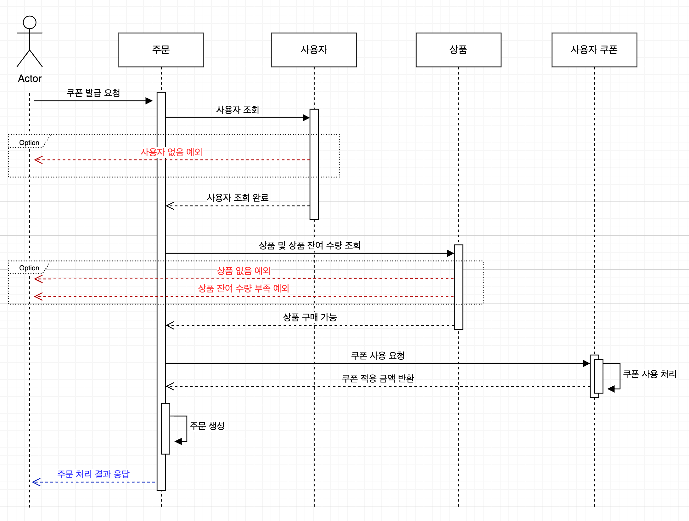

# 시퀀스 다이어그램

## ✅ 잔액 조회

- 사용자 식별자를 통해 잔액을 조회한다.
- 해당 사용자가 없는 경우 예외를 발생시킨다.

## ✅ 잔액 충전

- 사용자 식별자를 통해 잔액을 충전한다.
- 해당 사용자가 없는 경우 예외를 발생시킨다.

## ✅ 상품 조회

- 상품 정보(ID, 이름, 가격, 잔여 수량 등)를 조회한다.

## ✅ 선착순 쿠폰 발급

- 사용자 식별자를 통해 쿠폰을 발급한다.
- 해당 사용자가 없는 경우 예외를 발생시킨다.
- 쿠폰 발급 시 선착순으로 처리하며, 동시성 문제를 고려한다.
- 쿠폰 발급 시 중복 발급 여부를 확인한다.

## ✅ 상품 주문

- 사용자 식별자와 주문 상품 정보를 입력받아 주문을 생성한다.
- 해당 사용자가 없는 경우 / 상품이 없는 경우 / 상품 재고가 부족한 경우 예외를 발생시킨다.
- 주문 상태를 관리한다. (결제 대기, 결제 완료, 취소 등)

## ✅ 결제

- 충전된 잔액을 기반으로 결제 처리한다.
- 결제 시 사용자의 잔액과 주문금액을 비교하여 잔액이 부족할 경우 주문을 진행할 수 없다.
- 결제 성공 시 잔액과 상품 잔여수량이 차감되며, 주문 내역이 생성된다.

## ✅ 상위 상품 조회 및 저장 (스케줄링)

- 판매량이 가장 높은 상품을 조회한다.
- 스케줄링을 통해 주기적으로 상위 상품을 저장한다.
